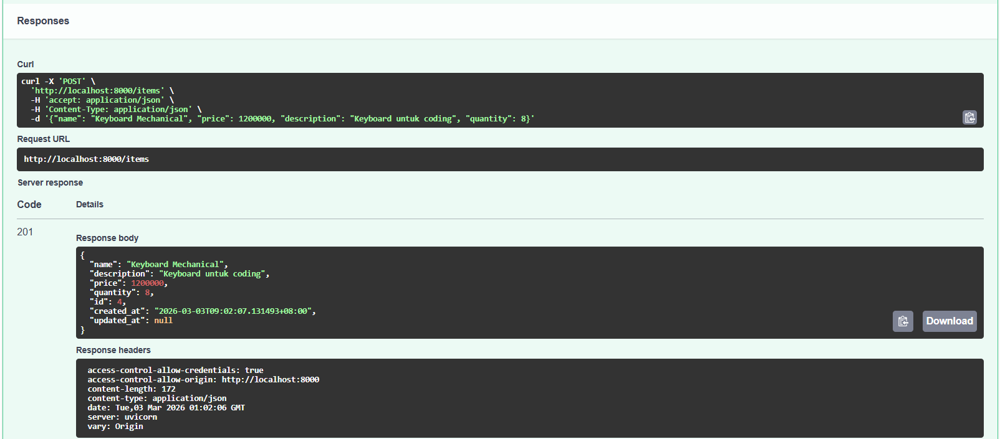
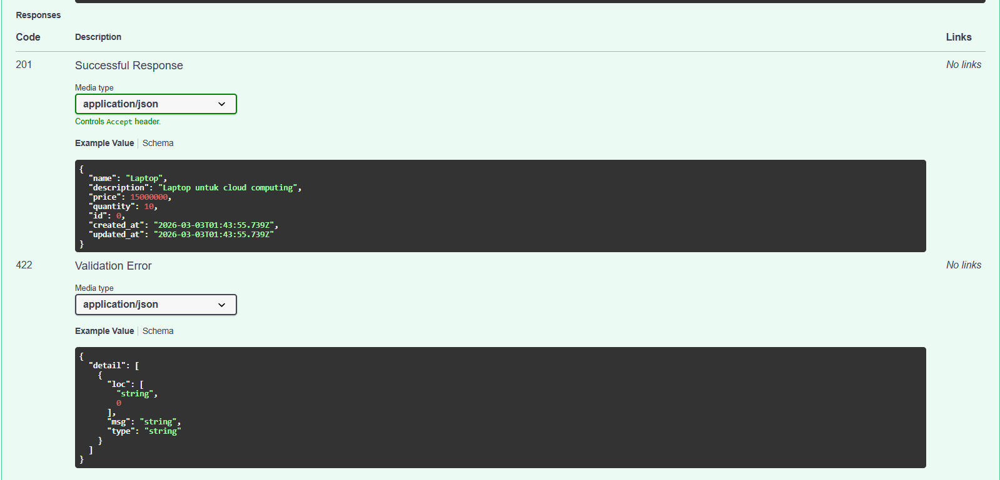
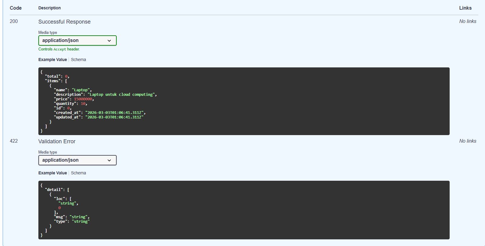

# ☁️ Cloud App - LAPORin ITK

LAPORin ITK atau singkatan dari Layanan Pelaporan *Online* Responsif Institut Teknologi Kalimantan adalah aplikasi berbasis *cloud* yang berfungsi sebagai saluran resmi untuk menerima, mengelola, dan melacak status pelaporan berbagai insiden di kampus, seperti kerusakan fasilitas, kehilangan barang, hingga kasus perundungan secara *real-time* dan terpusat dengan fitur opsi anonimitas. Aplikasi ini dirancang khusus untuk seluruh sivitas akademika Institut Teknologi Kalimantan (ITK), yang mencakup mahasiswa, dosen, dan tenaga kependidikan sebagai pelapor, serta pihak berwenang kampus sebagai admin pengelola laporan.

Kehadiran aplikasi ini menyelesaikan masalah keengganan melapor yang sering terjadi akibat birokrasi yang rumit atau ketakutan pelapor akan identitasnya yang terbongkar. Selain itu, sistem *cloud* pada LAPORin ITK memecahkan masalah manajemen data pelaporan yang tercecer atau tidak transparan, dengan memastikan setiap keluhan tersimpan aman di database dan status penanganannya (Menunggu, Diproses, Selesai) dapat dipantau secara langsung, menciptakan lingkungan kampus yang lebih aman dan responsif.

## 👥 Tim

| Nama                           | NIM      | Peran          |
| ------------------------------ | -------- | -------------- |
| Aditya Laksamana P Butar Butar | 10231006 | Lead Backend   |
| Firni Fauziah Ramadhini        | 10231038 | Lead Frontend  |
| Muhammad Novri Aziztra         | 10231066 | Lead DevOps    |
| Salsabila Putri Zahrani        | 10231086 | Lead QA & Docs |

## 🛠️ Tech Stack


| Teknologi      | Fungsi           |
| -------------- | ---------------- |
| FastAPI        | Backend REST API |
| React          | Frontend SPA     |
| PostgreSQL     | Database         |
| Docker         | Containerization |
| GitHub Actions | CI/CD            |
| Railway/Render | Cloud Deployment |
| Python         | Backend REST API |

## 🏗️ Architecture

```
[Client / Civitas ITK]
         |
      (HTTPS)
         |
         v
 [React Frontend (Vite)] <---REST API---> [FastAPI Backend]
                                            /           \
                                       (SQL/ORM)     (API/SDK)
                                          /               \
                                         v                 v
                                [PostgreSQL]         [Cloud Storage]
                              (Data Laporan,       (Penyimpanan File
                               Akun & Status)       Bukti Insiden)
```

## 🚀 Getting Started


### Prasyarat

- Python 3.11.x
- FastAPI 0.110+
- PostgreSQL 15.x
- Node.js 20.x (LTS)
- React 18.x
- Docker 24.x
- Docker Compose 2.x

### Backend

```bash
cd backend
pip install -r requirements.txt
uvicorn main:app --reload --port 8000
```

### Frontend

```bash
cd frontend
npm install
npm run dev
```

## 📅 Roadmap

| Minggu | Target                 | Status |
| ------ | ---------------------- | ------ |
| 1      | Setup & Hello World    | ✅     |
| 2      | REST API + Database    | ⬜     |
| 3      | React Frontend         | ⬜     |
| 4      | Full-Stack Integration | ⬜     |
| 5-7    | Docker & Compose       | ⬜     |
| 8      | UTS Demo               | ⬜     |
| 9-11   | CI/CD Pipeline         | ⬜     |
| 12-14  | Microservices          | ⬜     |
| 15-16  | Final & UAS            | ⬜     |

## Project Structure
```
cc-kelompok-bismillah_a/
├── backend/
│   ├── src/
│   ├── .env
│   ├── package.json
│   └── index.js
├── frontend/
│   ├── public/
│   ├── src/
│   │   ├── assets/
│   │   ├── components/
│   │   ├── hooks/
│   │   ├── pages/
│   │   ├── services/
│   │   ├── utils/
│   │   ├── App.jsx
│   │   └── main.jsx
│   ├── .env
│   ├── index.html
│   ├── package.json
│   └── vite.config.js
├── .gitignore
└── README.md
```
## Pengujian API
Kegiatan ini merupakan pengujian *endpoint* API menggunakan Swagger UI yang bertujuan untuk memastikan bahwa setiap layanan API pada sistem dapat berjalan dengan baik sesuai dengan fungsinya. API (*Application Programming Interface*) adalah penghubung yang memungkinkan dua aplikasi atau sistem dapat saling berkomunikasi dan bertukar data. Melalui API, sistem dapat melakukan berbagai proses seperti menambahkan data, menampilkan data, memperbarui data, dan menghapus data yang tersimpan di dalam database. Pengujian dilakukan menggunakan Swagger UI, yaitu sebuah alat berbasis web yang digunakan untuk melihat dokumentasi API serta mencoba endpoint API secara langsung tanpa perlu membuat tampilan aplikasi terlebih dahulu. Dengan menggunakan Swagger UI, pengembang dapat mengirim permintaan ke server dan melihat respon yang diberikan oleh sistem, sehingga dapat memastikan bahwa proses pengolahan data pada sistem berjalan dengan baik dan sesuai dengan yang diharapkan.

### 1. Proses Mengirim Request POST untuk Menambahkan Data

 

Gambar pertama menampilkan halaman untuk membuat data item baru melalui *endpoint* **POST /items** pada dokumentasi API di Swagger UI. Pada halaman ini terdapat penjelasan mengenai data yang harus diisi ketika ingin menambahkan item baru ke dalam sistem. Data tersebut meliputi *name* yang merupakan nama barang, *price* yang berisi harga barang, *description* sebagai deskripsi barang (bersifat opsional), dan *quantity* yang menunjukkan jumlah stok barang. Di bagian **request body* terlihat contoh data dalam format JSON yang akan dikirim ke server, yaitu item bernama *Keyboard Mechanical* dengan harga 120000, deskripsi “Keyboard untuk coding”, dan jumlah stok 8. Setelah data diisi, pengguna dapat menekan tombol Execute untuk mengirimkan permintaan ke server agar data tersebut diproses dan disimpan.

 

Gambar ini menunjukkan hasil setelah permintaan pengiriman data dilakukan. Pada bagian ini terlihat contoh perintah **cURL** yang dapat digunakan untuk melakukan request yang sama melalui terminal. Selain itu, terdapat Request URL yang menunjukkan alamat endpoint API yang digunakan, yaitu `http://localhost:8000/items`. Server kemudian memberikan **response code 201**, yang berarti data berhasil dibuat atau disimpan di server. Pada bagian **response body** ditampilkan kembali data item yang telah berhasil disimpan, lengkap dengan informasi tambahan seperti `id`, `created_at`, dan `updated_at`. Hal ini menandakan bahwa sistem telah memproses data yang dikirim dan menyimpannya di database.

 

Gambar ini menampilkan dokumentasi mengenai kemungkinan respons yang diberikan oleh API. Pada bagian **201 Successful Response**, ditunjukkan contoh format data yang akan diterima pengguna jika proses penambahan item berhasil. Data tersebut meliputi nama item, deskripsi, harga, jumlah stok, serta waktu pembuatan data. Selain itu, terdapat juga bagian **422 Validation Error**, yaitu respons yang muncul jika data yang dikirim tidak sesuai dengan ketentuan yang telah ditetapkan, misalnya ada field yang kosong atau format data tidak sesuai. Bagian ini membantu pengguna memahami bagaimana sistem memberikan respons baik ketika proses berhasil maupun ketika terjadi kesalahan input data.

### 2. Proses Mengirim Request GET untuk Mengambil Daftar Data

 

Gambar ini menampilkan halaman dokumentasi API pada Swagger UI untuk *endpoint* **GET /items** yang digunakan untuk mengambil daftar data item dari sistem. Pada halaman ini dijelaskan bahwa *endpoint* tersebut mendukung fitur *pagination* dan pencarian data. Terdapat beberapa parameter yang dapat diisi oleh pengguna, yaitu *skip*, *limit*, dan *search*. Parameter *skip* digunakan untuk menentukan jumlah data yang dilewati dari awal, sehingga sistem dapat menampilkan data mulai dari posisi tertentu. Parameter *limit* digunakan untuk menentukan jumlah maksimal data yang ditampilkan dalam satu permintaan atau satu halaman. Sedangkan parameter *search* digunakan untuk mencari item berdasarkan nama atau deskripsi tertentu. Setelah parameter diisi sesuai kebutuhan, pengguna dapat menekan tombol **Execute** untuk mengirim permintaan ke server agar sistem menampilkan daftar item yang sesuai dengan parameter yang diberikan.

 

Gambar ini menunjukkan hasil setelah permintaan data dilakukan melalui *endpoint* **GET /items**. Pada bagian ini ditampilkan contoh perintah **cURL** yang dapat digunakan untuk melakukan request yang sama melalui terminal atau aplikasi lain. Selain itu, terdapat bagian Request URL yang memperlihatkan alamat *endpoint* yang digunakan, yaitu `http://localhost:8000/items` dengan parameter *skip*, *limit*, dan *search* yang telah diisi sebelumnya. Server kemudian memberikan **response code 200**, yang berarti permintaan berhasil diproses oleh sistem. Pada bagian **response body** ditampilkan data dalam format JSON yang berisi informasi item yang ditemukan berdasarkan kata kunci pencarian, misalnya item dengan nama Laptop. Data tersebut mencakup beberapa atribut seperti *name*, *description*, *price*, *quantity*, serta informasi waktu seperti `created_at` dan `updated_at`. Hal ini menunjukkan bahwa sistem berhasil mengambil dan mengirimkan data item yang sesuai dengan permintaan pengguna.

 

Gambar ini menampilkan bagian dokumentasi yang menjelaskan jenis respons yang dapat diberikan oleh API ketika *endpoint* **GET /items** digunakan. Pada bagian **200 Successful Response**, ditampilkan contoh format data yang akan diterima pengguna apabila permintaan berhasil diproses oleh server. Data tersebut biasanya berisi jumlah total item serta daftar item yang ditemukan, lengkap dengan informasi seperti nama item, deskripsi, harga, jumlah stok, dan waktu pembuatan atau pembaruan data. Selain itu, terdapat juga bagian **422 Validation Error**, yaitu respons yang muncul apabila parameter yang dikirimkan oleh pengguna tidak sesuai dengan ketentuan yang telah ditetapkan oleh sistem. Contohnya adalah ketika format data tidak valid atau nilai parameter tidak memenuhi aturan yang berlaku. Bagian ini membantu pengguna memahami bagaimana sistem memberikan respons baik ketika proses berhasil maupun ketika terjadi kesalahan pada input atau permintaan yang dikirim.

### 3. 

 

Gambar ini menampilkan halaman dokumentasi API pada Swagger UI untuk *endpoint* **GET /items/{item_id}** yang digunakan untuk mengambil satu data item berdasarkan ID tertentu. Pada halaman ini terdapat bagian Parameters yang meminta pengguna memasukkan nilai `item_id` sebagai parameter utama. Parameter ini bersifat wajib karena sistem memerlukan ID untuk menentukan item mana yang akan diambil dari database. Pada contoh yang ditampilkan, nilai `item_id` diisi dengan angka 1. Setelah parameter diisi, pengguna dapat menekan tombol **Execute** untuk mengirim permintaan ke server agar sistem menampilkan data item yang sesuai dengan ID yang dimasukkan.

 

Gambar ini menunjukkan hasil setelah permintaan data dilakukan melalui *endpoint* **GET /items/{item_id}**. Pada bagian ini ditampilkan contoh perintah cURL yang dapat digunakan untuk melakukan request yang sama melalui terminal. Selain itu, terdapat bagian Request URL yang memperlihatkan alamat *endpoint* yang digunakan, yaitu `http://localhost:8000/items/1`. Server kemudian memberikan **response code 404 (Error: Not Found)**, yang berarti data dengan ID tersebut tidak ditemukan di dalam sistem. Pada bagian **response body** ditampilkan pesan dalam format JSON yang berisi keterangan bahwa item dengan ID tersebut tidak tersedia atau tidak ditemukan. Hal ini menunjukkan bahwa sistem telah memproses permintaan, tetapi tidak menemukan data yang sesuai dengan ID yang diminta.

 

Gambar ini menampilkan dokumentasi mengenai jenis respons yang dapat diberikan oleh API ketika *endpoint* **GET /items/{item_id}** digunakan. Pada bagian **200 Successful Response**, ditunjukkan contoh format data yang akan diterima pengguna apabila item dengan ID yang diminta berhasil ditemukan. Data tersebut biasanya berisi informasi lengkap seperti *name*, *description*, *price*, *quantity*, serta waktu pembuatan dan pembaruan data seperti `created_at` dan `updated_at`. Selain itu, terdapat juga bagian **422 Validation Error**, yaitu respons yang muncul jika parameter yang dikirimkan tidak sesuai dengan ketentuan sistem, misalnya format ID yang tidak valid atau kesalahan pada input data. Dokumentasi ini membantu pengguna memahami kemungkinan respons yang diberikan oleh sistem baik ketika proses berhasil maupun ketika terjadi kesalahan.

### 4. 

 

Gambar ini menampilkan halaman dokumentasi API pada Swagger UI untuk *endpoint* **PUT /items/{item_id}** yang digunakan untuk memperbarui data item berdasarkan ID tertentu. *Endpoint* ini memungkinkan pengguna melakukan *partial update*, yaitu hanya memperbarui *field* tertentu tanpa harus mengubah seluruh data item. Pada bagian **Parameters**, pengguna diminta memasukkan `item_id` sebagai identitas item yang akan diperbarui. Selain itu, terdapat bagian **Request body** yang berisi data dalam format JSON yang ingin diubah. Pada contoh yang ditampilkan, hanya *field price* yang diperbarui dengan nilai 1400000. Setelah data dimasukkan, pengguna dapat menekan tombol **Execute** untuk mengirim permintaan pembaruan data ke server agar sistem memproses perubahan tersebut.

 

Gambar ini menunjukkan hasil setelah permintaan pembaruan data dilakukan melalui endpoint PUT /items/{item_id}. Pada bagian ini ditampilkan contoh perintah **cURL** yang dapat digunakan untuk melakukan request yang sama melalui terminal. Selain itu, terdapat bagian Request URL yang menunjukkan alamat endpoint yang digunakan, yaitu `http://localhost:8000/items/1`. Server kemudian memberikan **response code 200**, yang berarti proses pembaruan data berhasil dilakukan. Pada bagian **response body**, sistem menampilkan kembali data item yang telah diperbarui dalam format JSON, termasuk informasi seperti *name*, *description*, *price*, *quantity*, serta waktu `created_at` dan `updated_at`. Nilai *price* pada data tersebut terlihat telah berubah sesuai dengan nilai baru yang dikirimkan, yang menandakan bahwa proses *update* berhasil dilakukan di *database*.

 

Gambar ini menampilkan dokumentasi mengenai jenis respons yang dapat diberikan oleh API ketika *endpoint* **PUT /items/{item_id}** digunakan. Pada bagian **200 Successful Response**, ditunjukkan contoh format data yang akan diterima pengguna apabila proses pembaruan data berhasil dilakukan. Data yang ditampilkan biasanya mencakup informasi lengkap item seperti nama, deskripsi, harga, jumlah stok, serta waktu pembuatan dan pembaruan data. Selain itu, terdapat juga bagian **422 Validation Error**, yaitu respons yang muncul apabila data yang dikirimkan tidak sesuai dengan aturan yang telah ditetapkan oleh sistem, misalnya format data yang tidak valid atau nilai yang tidak sesuai dengan tipe data yang ditentukan. Dokumentasi ini membantu pengguna memahami bagaimana sistem memberikan respons ketika proses pembaruan berhasil maupun ketika terjadi kesalahan pada data yang dikirim.

### 5. 

 

Gambar ini menampilkan halaman dokumentasi API pada Swagger UI untuk *endpoint* **DELETE /items/{item_id}** yang digunakan untuk menghapus data item dari sistem berdasarkan ID tertentu. Pada halaman ini terdapat bagian Parameters yang meminta pengguna memasukkan nilai `item_id` sebagai identitas item yang akan dihapus. Parameter ini bersifat wajib karena sistem perlu mengetahui item mana yang akan dihapus dari database. Pada contoh yang ditampilkan, nilai `item_id` diisi dengan angka 1. Setelah parameter tersebut diisi, pengguna dapat menekan tombol **Execute** untuk mengirim permintaan ke server agar sistem memproses penghapusan data item dengan ID yang telah ditentukan.

 

Gambar ini menunjukkan hasil setelah permintaan penghapusan data dilakukan melalui *endpoint* **DELETE /items/{item_id}**. Pada bagian ini ditampilkan contoh perintah **cURL** yang dapat digunakan untuk melakukan request yang sama melalui terminal. Selain itu, terdapat bagian Request URL yang memperlihatkan alamat *endpoint* API yang digunakan, yaitu `http://localhost:8000/items/1`. Server kemudian memberikan **response code 204**, yang berarti proses penghapusan data berhasil dilakukan dan tidak ada konten yang dikembalikan dalam **response body**. Pada bagian **response headers** ditampilkan beberapa informasi tambahan seperti tipe konten dan detail server yang digunakan. Hal ini menunjukkan bahwa sistem telah berhasil memproses permintaan penghapusan item dari database.

### 6. 

 

Gambar tersebut menampilkan halaman dokumentasi API pada Swagger UI untuk *endpoint* **GET /items/stats** yang digunakan untuk menampilkan statistik data item yang tersimpan dalam sistem. *Endpoint* ini berfungsi untuk memberikan ringkasan informasi mengenai data item yang tersimpan di dalam sistem. Pada bagian **Parameters** terlihat bahwa *endpoint* ini tidak memerlukan parameter tambahan, sehingga pengguna cukup menekan tombol **Execute** untuk menjalankan permintaan ke server.

Setelah permintaan dijalankan, sistem menampilkan bagian **cURL** yang menunjukkan contoh perintah yang dapat digunakan untuk melakukan request melalui terminal. Selain itu, terdapat Request URL yang memperlihatkan alamat endpoint yang digunakan, yaitu `http://127.0.0.1:8000/items/stats`. Server kemudian memberikan **response code 200**, yang menandakan bahwa permintaan berhasil diproses. Hasil respons ditampilkan dalam format JSON yang berisi beberapa informasi statistik, yaitu `total_items` yang menunjukkan jumlah keseluruhan item yang tersimpan sebanyak 3, serta `total_value` yang menunjukkan total nilai seluruh barang sebesar 8.460.000. Selain itu, sistem juga menampilkan informasi mengenai barang dengan harga paling mahal (*most_expensive*) yaitu Laptop dengan harga 1.400.000, serta barang dengan harga paling murah (*cheapest*) yaitu *Mouse Wireless* dengan harga 250.000. Informasi ini membantu pengguna untuk melihat ringkasan item yang tersimpan secara cepat dan terstruktur melalui satu *endpoint* API.