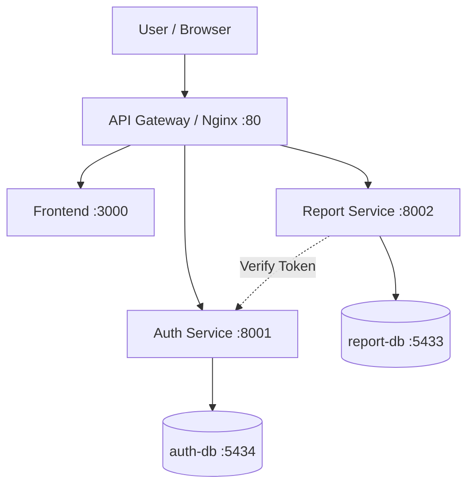

# 📋 LaporIn ITK

> Sistem Pelaporan Digital Institut Teknologi Kalimantan

[](https://fastapi.tiangolo.com/)
[](https://react.dev/)
[](https://docker.com/)
[](https://www.postgresql.org/)

---


---

## 🎯 Deskripsi

**LaporIn ITK** adalah platform pelaporan digital yang dirancang khusus untuk civitas akademika Institut Teknologi Kalimantan (ITK). Platform ini hadir sebagai jembatan antara pengguna kampus dan pihak yang berwenang — memungkinkan proses pelaporan yang selama ini dilakukan secara manual, lisan, atau tidak terstruktur, kini dapat dilakukan secara digital, terdokumentasi, dan dapat ditindaklanjuti dengan lebih efisien.

LaporIn ITK mencakup tiga kategori pelaporan utama:

- 🔍 **Kehilangan Barang** — Pengguna dapat membuat laporan kehilangan lengkap dengan titik lokasi kejadian yang ditandai langsung di peta interaktif berbasis Leaflet. Laporan yang masuk dapat dilihat oleh seluruh civitas akademika, sehingga informasi menyebar lebih luas dan peluang barang ditemukan kembali menjadi jauh lebih besar dibandingkan sekadar pengumuman lisan atau poster fisik.

- 🏗️ **Kerusakan Fasilitas** — Pengguna dapat melaporkan kerusakan infrastruktur kampus seperti atap bocor, peralatan laboratorium yang rusak, lampu mati, atau fasilitas umum yang tidak berfungsi. Setiap laporan dilengkapi dengan deskripsi kerusakan dan titik lokasi spesifik, sehingga pihak yang berwenang dapat mengidentifikasi masalah dan mengambil tindakan perbaikan dengan lebih cepat dan terarah.

- 🛡️ **Perundungan** — Pengguna dapat menyampaikan laporan terkait tindakan perundungan, intimidasi, atau perilaku tidak menyenangkan di lingkungan kampus secara anonim. Identitas pelapor dijaga penuh kerahasiaannya oleh sistem, sehingga korban maupun saksi dapat melapor tanpa rasa takut akan konsekuensi sosial. Fitur ini hadir sebagai wujud komitmen ITK terhadap lingkungan kampus yang aman dan kondusif bagi semua.

---

## 👥 Tim Pengembang — Kelompok Bismillah_A

| Nama | NIM | Role |
|------|-----|------|
| Aditya Laksamana P Butar Butar | 10231006 | Lead Backend |
| Firni Fauziah Ramadhini | 10231038 | Lead Frontend |
| Muhammad Novri Aziztra | 10231066 | Lead DevOps |
| Salsabila Putri Zahrani | 10231086 | Lead QA & Docs |

---

## 🏗️ Architecture


---

### Architecture Evolution

| Phase | Weeks | Architecture |
|-------|-------|-------------|
| Foundation | 1-4 | Monolith (FastAPI + React + PostgreSQL) |
| Containerization | 5-7 | Docker Compose (3 containers) |
| CI/CD | 9-11 | GitHub Actions + Railway deployment |
| Microservices | 12-14 | 2 services + gateway + monitoring |
| Final | 15-16 | Security hardened + production ready |

---

## 🛠️ Tech Stack

| Layer | Technology | Purpose |
|-------|-----------|---------|
| Frontend | React + Vite | Single Page Application |
| Backend | FastAPI (Python) | REST API microservices |
| Database | PostgreSQL 16 | Relational database (per service) |
| Gateway | Nginx | Reverse proxy + rate limiting |
| Container | Docker + Docker Compose | Containerization |
| CI/CD | GitHub Actions | Automated test + deploy |
| Cloud | Railway | PaaS deployment |
| Monitoring | Custom metrics + dashboard | Observability |

---

## 🚀 Quick Start

### Prerequisites
- Docker & Docker Compose
- Git

### Run Locally

```bash
# Clone repository
# Clone repository
git clone https://github.com/aidilsaputrakirsan-classroom/cc-kelompok-bismillah_a.git

cd cc-kelompok-bismillah_a

# Copy environment file
cp .env.example .env
# Edit .env with your values

# Start all services
docker compose up -d

# Verify
docker compose ps
curl http://localhost/health
```

Open http://localhost in your browser.

### Run Without Docker

```bash
# Backend (Auth Service)
cd services/auth-service
pip install -r requirements.txt
uvicorn main:app --reload --port 8001

# Backend (Report Service)
cd services/report-service
pip install -r requirements.txt
uvicorn main:app --reload --port 8002

# Frontend
cd frontend
npm install
npm run dev
```
---

## 📡 API Documentation

### Auth Service

| Method | Endpoint | Description | Auth |
|---|---|---|---|
| POST | `/auth/register` | Registrasi akun pengguna baru | ❌ |
| POST | `/auth/login` | Login pengguna dan mendapatkan JWT token | ❌ |
| GET | `/auth/verify` | Verifikasi JWT token untuk komunikasi internal antar-service | ✅ |
| GET | `/auth/me` | Menampilkan informasi pengguna yang sedang login | ✅ |
| GET | `/auth/metrics` | Menampilkan metrics Auth Service | ❌ |

> Catatan: Endpoint `/auth/health` hanya tersedia jika health check diimplementasikan pada Auth Service.

---

### Report Service

| Method | Endpoint | Description | Auth |
|---|---|---|---|
| GET | `/reports/health` | Health check Report Service dan koneksi database | ❌ |
| GET | `/reports/metrics` | Menampilkan metrics Report Service | ❌ |
| POST | `/reports` | Membuat laporan baru | ✅ |
| GET | `/reports` | Menampilkan daftar laporan dengan pagination dan filter | ✅ |
| GET | `/reports/{report_id}` | Menampilkan detail laporan berdasarkan ID | ✅ |
| PUT | `/admin/reports/{report_id}` | Memperbarui status atau prioritas laporan (Admin) | ✅ |
| POST | `/reports/{report_id}/comments` | Menambahkan komentar atau balasan pada laporan | ✅ |
| GET | `/admin/stats` | Menampilkan statistik laporan untuk dashboard admin | ✅ |
| GET | `/categories` | Menampilkan daftar kategori laporan | ✅ |
| GET | `/units` | Menampilkan daftar unit penanganan laporan | ✅ |
| GET | `/notifications` | Menampilkan daftar notifikasi pengguna | ✅ |
| GET | `/feedback` | Menampilkan data feedback laporan | ✅ |

---

### Gateway Access (Nginx)

| Endpoint Gateway | Service Tujuan | Keterangan |
|---|---|---|
| `/health` | Gateway | Health check Gateway |
| `/auth/*` | Auth Service | Endpoint autentikasi dan manajemen user |
| `/auth/metrics` | Auth Service | Metrics Auth Service |
| `/reports/*` | Report Service | Manajemen data laporan |
| `/reports/health` | Report Service | Health check Report Service |
| `/reports/metrics` | Report Service | Metrics Report Service |
| `/categories` | Report Service | Data kategori laporan |
| `/units` | Report Service | Data unit penanganan |
| `/notifications` | Report Service | Notifikasi pengguna |
| `/feedback` | Report Service | Feedback laporan |
| `/admin/*` | Report Service / Auth Service | Endpoint khusus admin |

---

## 🔐 Keamanan

- **Autentikasi menggunakan JWT** untuk mengamankan akses pengguna setelah melakukan login.
- **Token memiliki masa berlaku (expiration time)** sehingga akses pengguna dibatasi dalam periode tertentu.
- **Password disimpan menggunakan hashing bcrypt**, sehingga password tidak disimpan dalam bentuk plain text.
- **Validasi dan serialisasi data menggunakan Pydantic** agar request dan response sesuai dengan skema yang telah ditentukan.
- **CORS dikonfigurasi sesuai environment** untuk mengatur akses antara frontend dan backend.
- **Konfigurasi sensitif menggunakan environment variables**, seperti database URL, JWT secret key, dan konfigurasi lainnya agar tidak ditulis langsung di dalam source code.
- **Database dipisahkan untuk setiap service**, yaitu `auth-db` untuk `auth-service` dan `report-db` untuk `report-service`, sehingga setiap service memiliki tanggung jawab data yang terpisah.
- **Gateway Nginx menerapkan pembatasan akses dan routing request** sebagai pintu masuk utama komunikasi antara frontend dan backend.

---

## 📊 Monitoring

- **Structured Logging**  
  Setiap request dicatat dalam format JSON agar lebih mudah dianalisis. Informasi log meliputi `timestamp`, `level`, `service`, `message`, `method`, `path`, `status_code`, `duration_ms`, dan `correlation_id`.

- **Correlation ID**  
  Setiap request memiliki identifier unik untuk melakukan request tracing antar service. Correlation ID membantu proses debugging dengan menelusuri perjalanan request dari gateway ke service terkait.

- **Metrics Endpoint**  
  Service menyediakan endpoint `/metrics` untuk menampilkan data monitoring dalam format Prometheus, seperti jumlah request, jumlah error, latency, dan informasi performa lainnya.

- **Health Check**  
  Endpoint health check digunakan untuk memastikan service dan dependency berjalan dengan baik, seperti koneksi database dan kondisi aplikasi.

- **Circuit Breaker**  
  `report-service` menggunakan mekanisme circuit breaker ketika berkomunikasi dengan `auth-service`, sehingga dapat mencegah request berulang ke service yang sedang mengalami kegagalan.

- **Retry dan Backoff**  
  Komunikasi antar-service dilengkapi mekanisme retry dan backoff untuk meningkatkan ketahanan sistem ketika terjadi gangguan sementara pada service lain.

- **Docker Container Monitoring**  
  Kondisi setiap service dapat dipantau menggunakan `docker compose ps` dan `docker compose logs` untuk memastikan seluruh container berjalan dengan normal.

---

## 📄 Documentation

- [Architecture Guide](docs/architecture.md)
- [Deployment Guide](docs/deployment-guide.md)
- [Operations Guide](docs/operations-guide.md)
- [API Contract](docs/api-contract.md)
- [Release Notes](docs/release-notes-m3.md)
- [Dokumentasi hasil testing semua endpoint via Swagger](docs/api-test-results.md)
- [Dokumentasi UI testing](docs/ui-test-results.md)
- [Dokumentasi Auth testing](docs/auth-test-results.md)
- [Docker Cheatsheet](docs/docker-cheatsheet.md)
- [Setup Guide](docs/setup-guide.md)
- [Testing Guide](docs/testing-guide.md)
- [Production Test](docs/production-test.md)
- [Git Workflow](docs/git-workflow.md)

---

## 📦 Modul Aplikasi

### 1. Modul Autentikasi

#### Endpoint API
| No | Fitur | Endpoint | Method | Keterangan |
| --- | --- | --- | --- | --- |
| 1 | Registrasi Akun | `/auth/register` | POST | Mendaftarkan akun pengguna baru dengan validasi nama, email, password, dan nomor HP |
| 2 | Login | `/auth/login` | POST | Autentikasi pengguna dan mengembalikan JWT token |
| 3 | Get Current User | `/auth/me` | GET | Mengambil data pengguna yang sedang login berdasarkan token |
| 4 | Logout | `/auth/logout` | POST | Mengakhiri sesi pengguna dan menghapus token dari sisi client |

#### Halaman & Fitur UI
| No | Halaman | Deskripsi |
| --- | --- | --- |
| 1 | Landing Page | Halaman awal dengan tombol navigasi ke Register dan Login |
| 2 | Register | Form pendaftaran dengan validasi nama, email, format password, dan nomor HP |
| 3 | Login | Form login dengan validasi input dan penyimpanan JWT ke LocalStorage |
| 4 | Logout | Menghapus token dari LocalStorage dan mengarahkan pengguna kembali ke halaman login |

---

### 2. Modul Laporan

#### Endpoint API
| No | Fitur | Endpoint | Method | Keterangan |
| --- | --- | --- | --- | --- |
| 1 | Buat Laporan | `/reports` | POST | Membuat laporan baru dengan kategori, judul, deskripsi, tanggal, dan koordinat lokasi opsional |
| 2 | Lihat Laporan Saya | `/reports/me` | GET | Menampilkan seluruh laporan milik pengguna yang sedang login |
| 3 | Detail Laporan | `/reports/{id}` | GET | Menampilkan detail laporan berdasarkan ID |
| 4 | Edit Laporan | `/reports/{id}` | PUT | Memperbarui data laporan yang sudah dibuat oleh pengguna |
| 5 | Hapus Laporan | `/reports/{id}` | DELETE | Menghapus laporan milik pengguna |
| 6 | Filter Laporan | `/reports?status={}&type={}` | GET | Menyaring laporan berdasarkan status dan/atau kategori |

#### Halaman & Fitur UI
| No | Halaman | Deskripsi |
| --- | --- | --- |
| 1 | Buat Laporan | Form input dengan pemilihan kategori, judul, deskripsi, tanggal, opsi anonim, dan penanda lokasi di peta interaktif |
| 2 | Laporan Saya | Daftar laporan milik pengguna dengan filter status dan kategori, termasuk empty state saat belum ada laporan |
| 3 | Detail Laporan | Informasi lengkap laporan beserta titik lokasi di peta |
| 4 | Edit Laporan | Form untuk memperbarui data laporan yang sudah dibuat sebelumnya |
| 5 | Hapus Laporan | Konfirmasi penghapusan laporan sebelum data benar-benar dihapus |

---

### 3. Modul Peta Interaktif

#### Endpoint API
| No | Fitur | Endpoint | Method | Keterangan |
| --- | --- | --- | --- | --- |
| 1 | Simpan Koordinat | `/reports` | POST | Menyimpan koordinat lokasi yang dipilih pengguna saat membuat laporan (bersifat opsional) |
| 2 | Ambil Koordinat Laporan | `/maps/reports` | GET | Mengambil seluruh titik koordinat laporan untuk ditampilkan di peta |

#### Halaman & Fitur UI
| No | Fitur | Deskripsi |
| --- | --- | --- |
| 1 | Penanda Lokasi | Pengguna dapat mengklik peta untuk menentukan titik lokasi kejadian, menampilkan marker, dan menghapusnya jika diperlukan |
| 2 | Peta Detail Laporan | Menampilkan titik lokasi laporan di atas peta berbasis Leaflet |
| 3 | Zoom & Navigasi | Pengguna dapat memperbesar dan memperkecil tampilan peta secara interaktif |

---

### 4. Modul Admin — Kelola Laporan

#### Endpoint API
| No | Fitur | Endpoint | Method | Keterangan |
| --- | --- | --- | --- | --- |
| 1 | Lihat Semua Laporan | `/admin/reports` | GET | Menampilkan seluruh laporan dari semua pengguna |
| 2 | Detail Laporan | `/admin/reports/{id}` | GET | Menampilkan detail laporan berdasarkan ID |
| 3 | Update Status Laporan | `/admin/reports/{id}/status` | PATCH | Mengubah status laporan menjadi sedang ditangani atau selesai |
| 4 | Assign Unit | `/admin/reports/{id}/assign` | PATCH | Menugaskan laporan ke unit yang bertanggung jawab |
| 5 | Filter Laporan | `/admin/reports?status={}&type={}` | GET | Menyaring laporan berdasarkan status dan/atau kategori |

#### Halaman & Fitur UI
| No | Fitur | Deskripsi |
| --- | --- | --- |
| 1 | Dashboard Laporan | Seluruh laporan masuk ditampilkan dengan filter status, kategori, dan kombinasi keduanya |
| 2 | Detail Laporan | Modal yang menampilkan informasi lengkap laporan saat diklik |
| 3 | Ubah Status | Dropdown untuk mengubah status laporan secara langsung dari dashboard |
| 4 | Assign Unit | Modal untuk menugaskan laporan ke unit yang bertanggung jawab |

---

### 5. Modul Admin — Statistik

#### Endpoint API
| No | Fitur | Endpoint | Method | Keterangan |
| --- | --- | --- | --- | --- |
| 1 | Data Statistik | `/admin/statistics` | GET | Mengambil data agregat laporan untuk ditampilkan dalam bentuk grafik |

#### Halaman & Fitur UI
| No | Fitur | Deskripsi |
| --- | --- | --- |
| 1 | Donut Chart | Visualisasi proporsi laporan berdasarkan kategori, dilengkapi tooltip saat di-hover |
| 2 | Bar Chart | Visualisasi jumlah laporan berdasarkan status atau periode waktu, dilengkapi tooltip saat di-hover |
| 3 | Navigasi Antar Dashboard | Tombol untuk berpindah kembali ke halaman dashboard laporan |

---

## 🗄️ Database Schema

Berikut adalah detail arsitektur database PostgreSQL yang digunakan oleh aplikasi **LaporIn ITK** berdasarkan model SQLAlchemy yang digunakan pada backend.

```
users → reports ← categories
reports → report_locations (tracking)
reports → report_attachments (foto/bukti)
reports → report_status_logs (riwayat status)
reports → comments ← users
reports → report_assignments → units
reports → feedback
users → notifications
```

---

### Tabel: users

| Atribut         | Tipe | Keterangan                     |
| --------------- | ---- | ------------------------------ |
| id              | PK   | Primary key                    |
| email           | -    | Email pengguna                 |
| name            | -    | Nama lengkap pengguna          |
| hashed_password | -    | Password yang sudah dienkripsi |
| phone           | -    | Nomor HP pengguna              |
| is_active       | -    | Status aktif akun              |
| is_admin        | -    | Penanda apakah pengguna admin  |
| created_at      | -    | Waktu akun dibuat              |
| updated_at      | -    | Waktu data terakhir diperbarui |

---

### Tabel: categories

| Atribut     | Tipe | Keterangan                                                      |
| ----------- | ---- | --------------------------------------------------------------- |
| id          | PK   | Primary key                                                     |
| name        | -    | Nama kategori laporan (kehilangan, kerusakan, atau perundungan) |
| description | -    | Deskripsi singkat kategori                                      |
| is_active   | -    | Status aktif kategori                                           |
| created_at  | -    | Waktu dibuat                                                    |

---

### Tabel: reports

| Atribut       | Tipe | Keterangan                                            |
| ------------- | ---- | ----------------------------------------------------- |
| id            | PK   | Primary key                                           |
| user_id       | FK   | Relasi ke `users.id` — pemilik laporan                |
| category_id   | FK   | Relasi ke `categories.id` — kategori laporan          |
| title         | -    | Judul laporan                                         |
| description   | -    | Deskripsi detail laporan                              |
| status        | -    | Status laporan: baru, diproses, selesai, atau ditutup |
| is_anonymous  | -    | Penanda apakah laporan dikirim secara anonim          |
| incident_date | -    | Tanggal kejadian yang dilaporkan                      |
| created_at    | -    | Waktu laporan dibuat                                  |
| updated_at    | -    | Waktu laporan terakhir diperbarui                     |

---

### Tabel: report_locations

| Atribut    | Tipe | Keterangan                                      |
| ---------- | ---- | ----------------------------------------------- |
| id         | PK   | Primary key                                     |
| report_id  | FK   | Relasi ke `reports.id`                          |
| latitude   | -    | Koordinat lintang lokasi kejadian               |
| longitude  | -    | Koordinat bujur lokasi kejadian                 |
| address    | -    | Alamat atau keterangan lokasi dalam bentuk teks |
| created_at | -    | Waktu data lokasi disimpan                      |

---

### Tabel: report_attachments

| Atribut    | Tipe | Keterangan                                              |
| ---------- | ---- | ------------------------------------------------------- |
| id         | PK   | Primary key                                             |
| report_id  | FK   | Relasi ke `reports.id`                                  |
| file_url   | -    | URL file lampiran (foto atau dokumen pendukung laporan) |
| file_type  | -    | Jenis file yang dilampirkan                             |
| created_at | -    | Waktu lampiran diunggah                                 |

---

### Tabel: report_status_logs

| Atribut    | Tipe | Keterangan                                        |
| ---------- | ---- | ------------------------------------------------- |
| id         | PK   | Primary key                                       |
| report_id  | FK   | Relasi ke `reports.id`                            |
| changed_by | FK   | Relasi ke `users.id` — admin yang mengubah status |
| old_status | -    | Status laporan sebelum diubah                     |
| new_status | -    | Status laporan setelah diubah                     |
| notes      | -    | Catatan atau alasan perubahan status              |
| created_at | -    | Waktu perubahan status dicatat                    |

---

### Tabel: comments

| Atribut    | Tipe | Keterangan                                               |
| ---------- | ---- | -------------------------------------------------------- |
| id         | PK   | Primary key                                              |
| report_id  | FK   | Relasi ke `reports.id`                                   |
| user_id    | FK   | Relasi ke `users.id` — pengguna yang memberikan komentar |
| content    | -    | Isi komentar                                             |
| created_at | -    | Waktu komentar dibuat                                    |
| updated_at | -    | Waktu komentar terakhir diperbarui                       |

---

### Tabel: units

| Atribut     | Tipe | Keterangan                                         |
| ----------- | ---- | -------------------------------------------------- |
| id          | PK   | Primary key                                        |
| name        | -    | Nama unit yang bertanggung jawab menangani laporan |
| description | -    | Deskripsi tugas dan tanggung jawab unit            |
| contact     | -    | Informasi kontak unit                              |
| is_active   | -    | Status aktif unit                                  |
| created_at  | -    | Waktu data unit dibuat                             |

---

### Tabel: report_assignments

| Atribut     | Tipe | Keterangan                                            |
| ----------- | ---- | ----------------------------------------------------- |
| id          | PK   | Primary key                                           |
| report_id   | FK   | Relasi ke `reports.id`                                |
| unit_id     | FK   | Relasi ke `units.id` — unit yang ditugaskan           |
| assigned_by | FK   | Relasi ke `users.id` — admin yang melakukan penugasan |
| notes       | -    | Catatan penugasan                                     |
| created_at  | -    | Waktu penugasan dilakukan                             |

---

### Tabel: feedback

| Atribut    | Tipe | Keterangan                                               |
| ---------- | ---- | -------------------------------------------------------- |
| id         | PK   | Primary key                                              |
| report_id  | FK   | Relasi ke `reports.id`                                   |
| user_id    | FK   | Relasi ke `users.id` — pengguna yang memberikan feedback |
| rating     | -    | Penilaian pengguna terhadap penanganan laporan           |
| content    | -    | Komentar atau masukan terkait proses penanganan          |
| created_at | -    | Waktu feedback diberikan                                 |

---

### Tabel: notifications

| Atribut    | Tipe | Keterangan                                              |
| ---------- | ---- | ------------------------------------------------------- |
| id         | PK   | Primary key                                             |
| user_id    | FK   | Relasi ke `users.id` — penerima notifikasi              |
| report_id  | FK   | Relasi ke `reports.id` — laporan yang memicu notifikasi |
| message    | -    | Isi pesan notifikasi                                    |
| is_read    | -    | Penanda apakah notifikasi sudah dibaca                  |
| created_at | -    | Waktu notifikasi dibuat                                 |

---

### Ringkasan Relasi Utama

| Relasi                           | Kardinalitas | Penjelasan                                                                         |
| -------------------------------- | ------------ | ---------------------------------------------------------------------------------- |
| users → reports                  | 1 : N        | Satu pengguna dapat membuat banyak laporan                                         |
| categories → reports             | 1 : N        | Satu kategori dapat mencakup banyak laporan                                        |
| reports → report_locations       | 1 : 1        | Satu laporan memiliki satu data lokasi                                             |
| reports → report_attachments     | 1 : N        | Satu laporan dapat memiliki banyak lampiran foto atau dokumen                      |
| reports → report_status_logs     | 1 : N        | Satu laporan memiliki banyak riwayat perubahan status                              |
| reports → comments               | 1 : N        | Satu laporan dapat memiliki banyak komentar dari pengguna maupun admin             |
| users → comments                 | 1 : N        | Satu pengguna dapat memberikan banyak komentar pada berbagai laporan               |
| reports → report_assignments     | 1 : N        | Satu laporan dapat ditugaskan ke satu atau lebih unit penanganan                   |
| units → report_assignments       | 1 : N        | Satu unit dapat menerima penugasan dari banyak laporan                             |
| reports → feedback               | 1 : 1        | Satu laporan hanya menerima satu feedback dari pengguna setelah penanganan selesai |
| users → notifications            | 1 : N        | Satu pengguna dapat menerima banyak notifikasi terkait perkembangan laporannya     |

---

## 🐳 Docker Cheatsheet

Lihat: [`docs/docker-cheatsheet.md`](docs/docker-cheatsheet.md)

---

## 👨‍💻 Developer Workflow

Sejak Modul 9, tim menerapkan **GitHub Flow** sebagai standar pengembangan proyek. Untuk menjaga kualitas kode dan meminimalkan potensi masalah saat integrasi, setiap anggota tim diwajibkan melakukan pengecekan secara lokal menggunakan `Makefile` sebelum melakukan push ke branch masing-masing.

### Perintah Makefile

Jalankan perintah berikut melalui terminal:

- `make lint` : Memeriksa kualitas kode backend menggunakan linter (`flake8`) agar sesuai dengan standar penulisan yang telah ditetapkan.
- `make test` : Menjalankan pengujian unit pada aplikasi.
- `make pr-check` : **Wajib dijalankan sebelum push.** Perintah ini akan melakukan build ulang Docker container serta menjalankan proses linting dan testing secara otomatis.

### Alur Kontribusi

1. Sinkronkan repository lokal dengan branch `main` terbaru:
   ```bash
   git checkout main
   git pull origin main
   ```

2. Buat branch baru sesuai kebutuhan fitur atau perbaikan:
   ```bash
   git checkout -b tipe/nama-fitur
   ```

3. Lakukan pengembangan atau perubahan kode pada branch tersebut.

4. Jalankan verifikasi kode:
   ```bash
   make pr-check
   ```

5. Setelah seluruh pengecekan berhasil, lakukan commit dan push ke repository.

6. Buat Pull Request melalui GitHub dan ajukan perubahan untuk direview oleh anggota tim lainnya.

---

## 🌐 Live Demo

| Service | URL |
|---------|-----|
| Frontend | [https://cc-kelompok-strangerthings.akhzafachrozy.my.id](https://cc-kelompok-strangerthings.akhzafachrozy.my.id) |

---

## 🔄 CI/CD

Pipeline otomatis berjalan saat push ke main:
1. ✅ Test backend (pytest)
2. ✅ Test frontend (Vitest)
3. ✅ Build Docker images
4. ✅ Static analysis dan quality checks

---

## 📅 Roadmap

| Minggu | Target                 | Status |
| ------ | ---------------------- | ------ |
| 1      | Setup & Hello World    | ✅     |
| 2      | REST API + Database    | ✅     |
| 3      | React Frontend         | ✅     |
| 4      | Full-Stack Integration | ✅     |
| 5-7    | Docker & Compose       | ✅     |
| 8      | UTS Demo               | ✅     |
| 9-11   | CI/CD Pipeline         | ✅     |
| 12-14  | Microservices          | ✅     |
| 15-16  | Final & UAS            | ⬜     |

---

