# Dokumentasi Hasil Testing Semua Endpoint Via Swagger/Thunder Client

Kegiatan ini merupakan pengujian _endpoint_ API menggunakan **Swagger UI** untuk memastikan setiap layanan API pada sistem LaporIn ITK berjalan dengan baik sesuai fungsinya. API memungkinkan aplikasi frontend saling berkomunikasi dan bertukar data dengan backend, seperti melakukan autentikasi, menambah laporan, menampilkan, memperbarui status tiket, dan fitur lainnya. Melalui Swagger UI, pengembang dapat melihat dokumentasi API secara lengkap, mengirim permintaan uji coba ke server, serta melihat respons sistem secara langsung.

---

## API Endpoints

Base URL: `http://localhost:8000`  
Dokumentasi interaktif: `http://localhost:8000/docs`

| Method   | Endpoint                      | Deskripsi                                         | Status Code     |
| -------- | ----------------------------- | ------------------------------------------------- | --------------- |
| `GET`    | `/health`                     | Health check API untuk memastikan server berjalan | 200             |
| `POST`   | `/auth/login`                 | Endpoint login untuk mendapatkan token JWT        | 200 / 401       |
| `POST`   | `/reports`                    | Menambahkan data laporan baru (user)              | 201 / 422       |
| `GET`    | `/reports`                    | Mengambil daftar laporan (pagination + filter)    | 200 / 422       |
| `GET`    | `/reports/{report_id}`        | Mengambil detail satu laporan berdasarkan ID      | 200 / 403 / 404 |
| `PUT`    | `/admin/reports/{report_id}`  | Memperbarui status/prioritas laporan (Admin)      | 200 / 404 / 422 |
| `POST`   | `/reports/{id}/comments`      | Menambahkan komentar/balasan pada laporan         | 201 / 403 / 404 |
| `GET`    | `/admin/stats`                | Menampilkan statistik laporan di dashboard admin  | 200 / 403       |

---

### 1. Proses Mengirim Request POST untuk Menambahkan Data Laporan

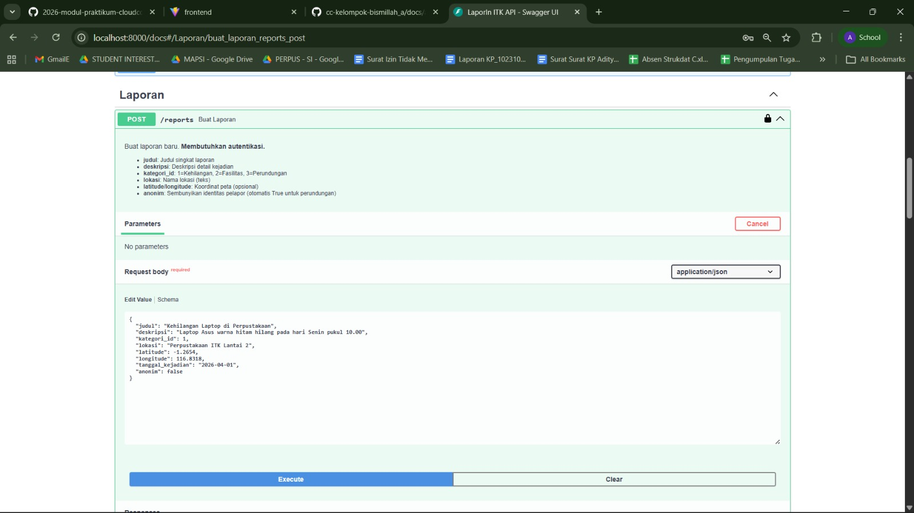

Gambar ini menampilkan fitur untuk membuat laporan pelanggaran, kehilangan, atau kerusakan fasilitas baru melalui _endpoint_ **POST /reports** di Swagger UI. Pengguna yang sudah login perlu mengisi beberapa data seperti **judul** laporan, **deskripsi** rinci kejadian, **kategori_id** (tipe laporan), dan **lokasi**. Pada bagian **request body** ditampilkan contoh data dalam format JSON. Setelah parameter diisi, pengguna menekan tombol **Execute** untuk mengirim masukan ke server LaporIn ITK.

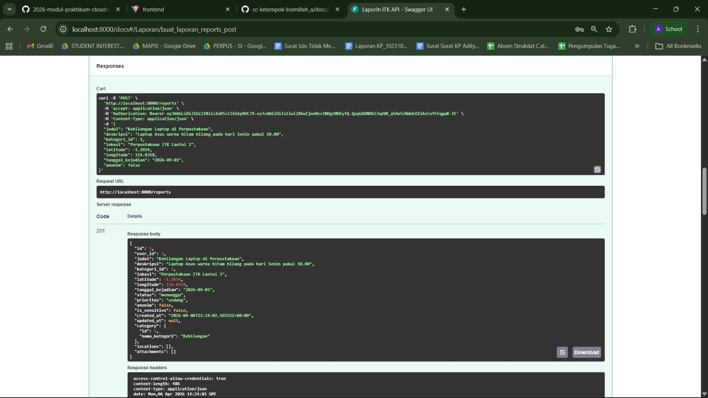

Gambar ini menunjukkan hasil setelah permintaan pengiriman data laporan dilakukan. Terlihat perintah **cURL** untuk mereplikasi permintaan, beserta URL `http://localhost:8000/reports`. Server memberikan **response code 201**, yang berarti data laporan berhasil dibuat di sisi server. Pada bagian **response body**, ditampilkan kembalian data laporan yang baru saja tersimpan di database, dilengkapi dengan `id` laporan, `status` awal (biasanya menunggu), dan penanda waktu `created_at`. 

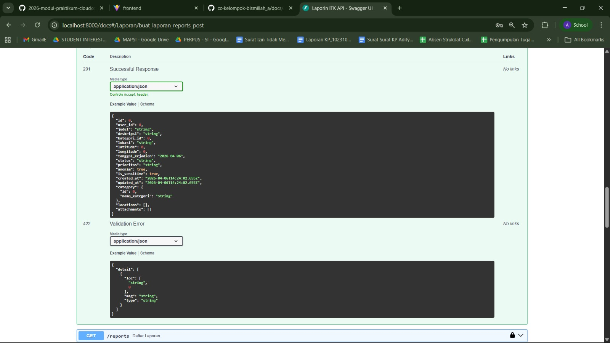

Gambar ini menunjukkan dokumentasi tentang ketentuan respons dari API. Pada bagian **201 Successful Response**, terlihat skema data kembalian jika laporan berhasil diterima. Selain itu, ada dokumentasi untuk **422 Validation Error**, yang akan dikembalikan oleh sistem jika pengguna mengirimkan format yang salah (misalnya tipe data `kategori_id` berupa string padahal seharusnya integer, atau parameter wajib tidak diisi).

---

### 2. Proses Mengirim Request GET untuk Mengambil Daftar Laporan

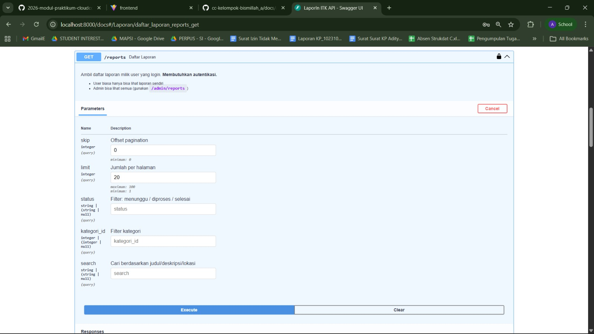

Gambar dokumentasi Swagger UI untuk _endpoint_ **GET /reports** ini digunakan untuk mengambil seluruh daftar laporan. _Endpoint_ ini mendukung fitur _pagination_ dan pencarian dengan berbagai parameter seperti **skip** (offset halaman), **limit** (jumlah laporan maksimal), **status**, **kategori_id**, serta opsi **search**. Setelah parameter disesuaikan atau dibiarkan secara default, pengguna dapat menekan **Execute**.

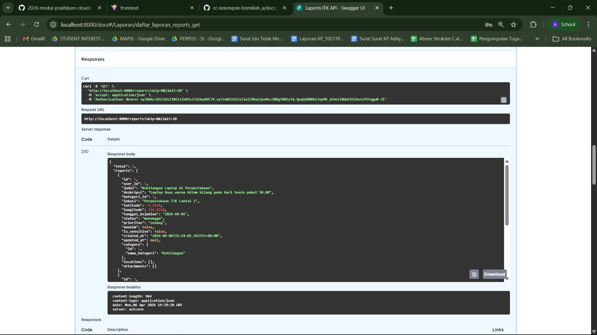

Gambar ini adalah contoh hasil pengambilan laporan dari server. Server merespons dengan **code 200**, menandakan operasi pengambilan daftar laporan berjalan lancar. Pada bagian **response body**, disajikan struktur berbentuk array format JSON yang berisi kumpulan laporan dengan nilai informasi selengkapnya (kategori, status terkini, penulis laporan beserta deskripsinya).

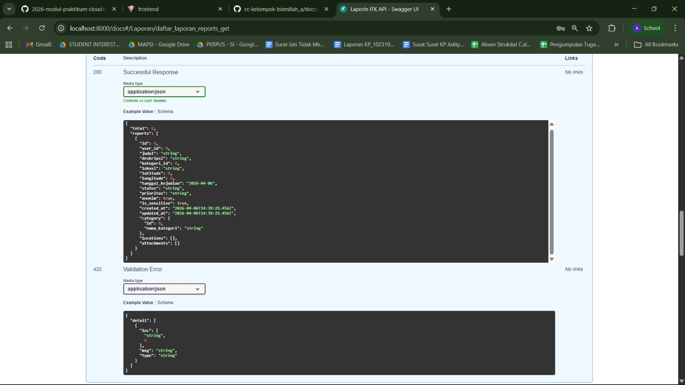

Ini adalah panduan dokumentasi Swagger terkait `Response body` yang dikembalikan, di mana _200 Successful Response_ menjelaskan struktur array data laporan yang sukses dikembalikan dari server.

---

### 3. Proses Mengambil Detail Satu Laporan Berdasarkan ID

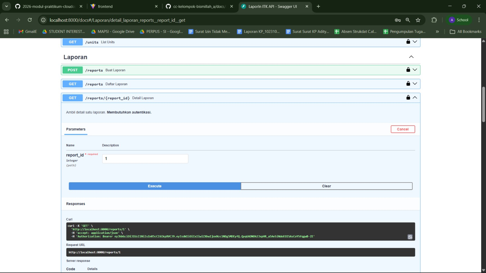

Gambar ini menunjukkan parameter input untuk _endpoint_ **GET /reports/{report_id}** guna memanggil detail satu data laporan saja. Di sini, **report_id** merupakan parameter wajib.

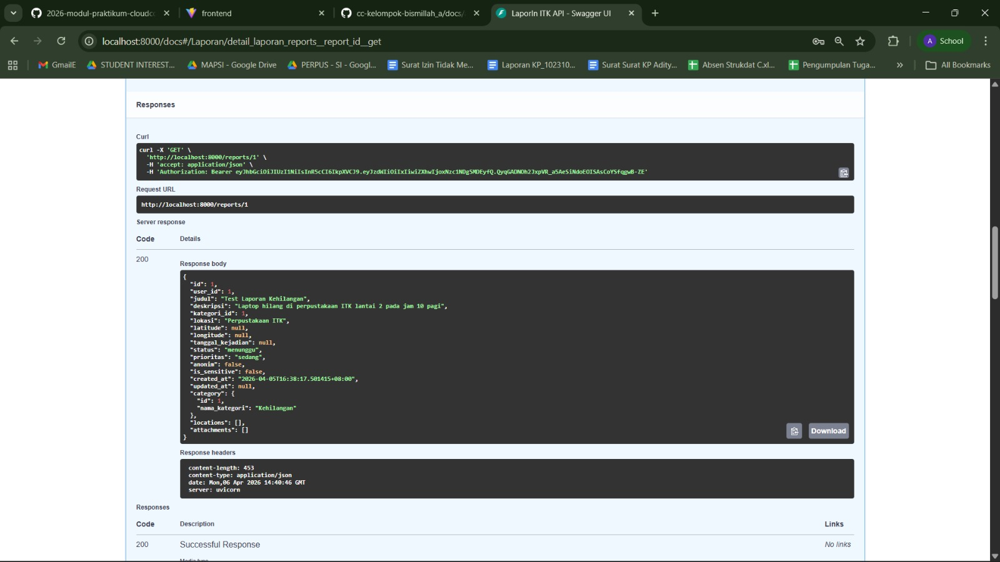

Gambar ini menyimulasikan hasil permintaan apabila `report_id` yang dimasukkan salah, tidak ditemukan, atau pengguna tidak memiliki wewenang untuk mengakses data laporan dari pengguna lain. Server dapat memberikan **response code 404 (Not Found)** atau **403 (Forbidden)** sebagai bentuk proteksi data. Pada tangkapan layar, detail pesan JSON akan menerangkan mengapa akses ditolak.

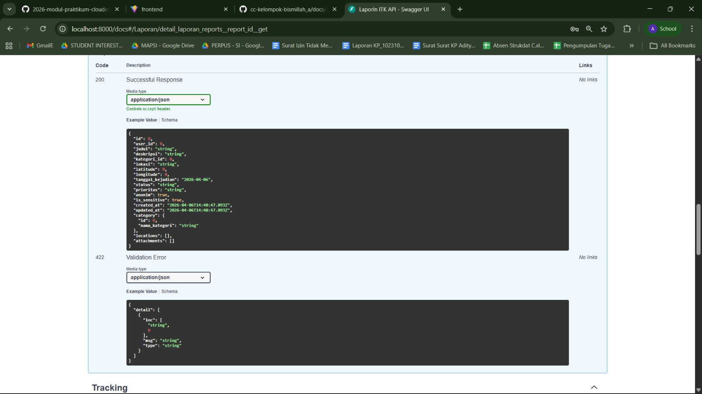

Dokumentasi bentuk struktur respons yang sesuai dari **GET /reports/{report_id}**. Berisi rincian informasi laporan tunggal jika status kode adalah **200**, atau `ValidationError` dan notifikasi `Not Found` pada kondisi sebaliknya.

---

### 4. Proses Memperbarui Laporan (Admin Update Status)

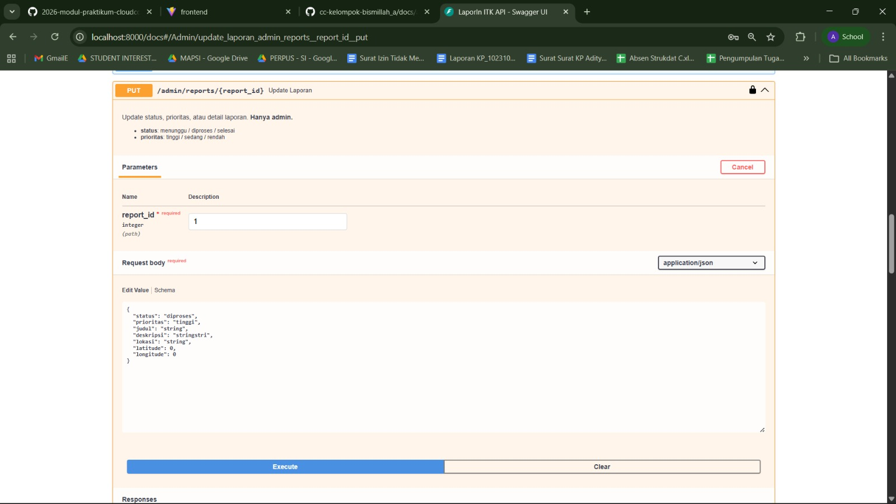

_Endpoint_ pembaruan (**PUT /admin/reports/{report_id}**) ini digunakan khusus untuk pihak admin untuk mengelola tahapan penanganan laporan, seperti mengubah _status_ dari "menunggu" menjadi "diproses" atau "selesai", serta menetapkan label _prioritas_. Pada Swagger, parameter `report_id` disertakan bersama **request body** pembaruannya dalam format JSON.

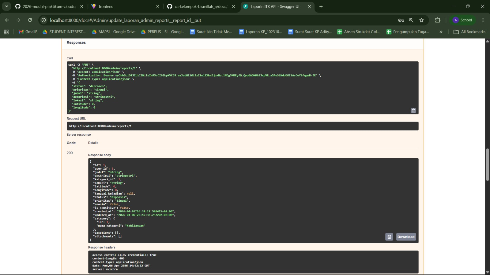

Ini menunjukkan hasil kembalian dari fitur admin setelah proses pembaruan berhasil dikirim. Melalui **code 200**, nilai balikan API memperlihatkan histori `status` laporan yang kini sudah dimutakhirkan, sehingga integrasinya dengan aplikasi/UI akan sejalan dengan perkembangan penyelesaian dari admin ITK.

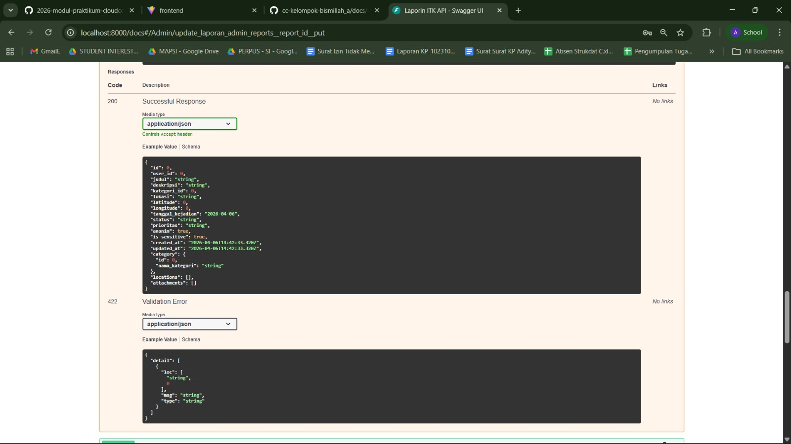

Gambar ini menampilkan dokumentasi standar terhadap kondisi validasi ketika admin ingin memproses pembaruan melalui instrumen `PUT`. Hal ini merinci struktur apa saja yang diizinkan untuk diubah, dengan ketentuan berhasil (200), atau gagal divalidasi apabila kurang tepat.

---

### 5. Proses Memberikan Komentar pada Laporan

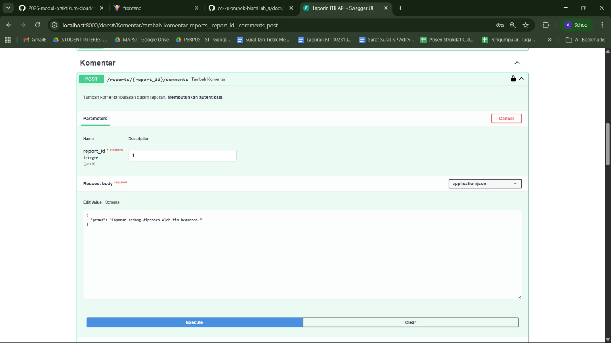

Pada bagian ini, diilustrasikan kegunaan dari _endpoint_ **POST /reports/{report_id}/comments**, yang memfasilitasi diskusi tambahan antara unit penanganan / pihak admin dengan pelapor pada suatu _thread_ riwayat kasus laporan.

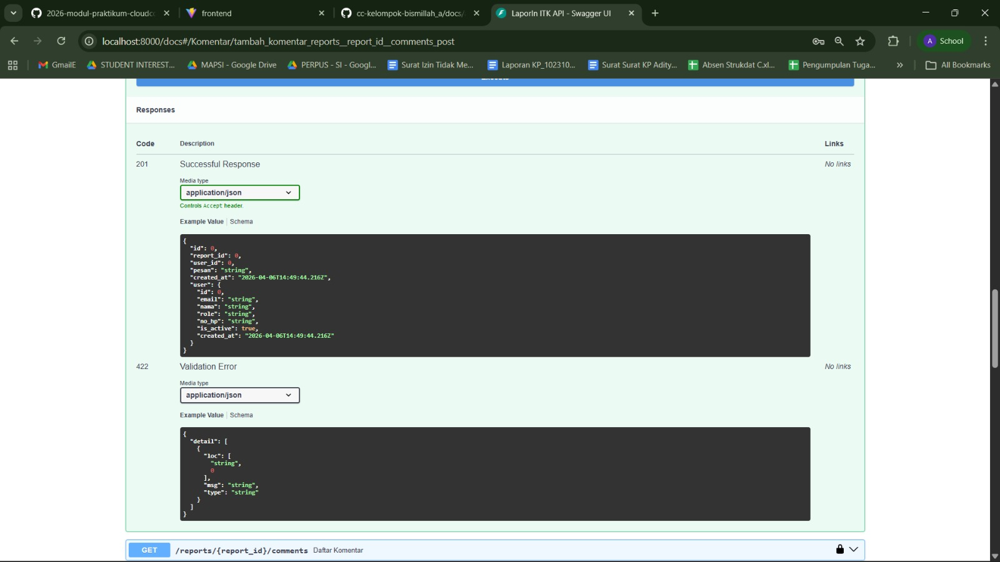

Sistem merespons dengan kode HTTP **201**, memastikan bahwa tanggapan atau komentar berjalur komunikasi tersebut sukses direkam oleh entitas database dengan merujuk pada `report_id` yang saling berkaitan.

---

### 6. Menampilkan Statistik Data Laporan Admin

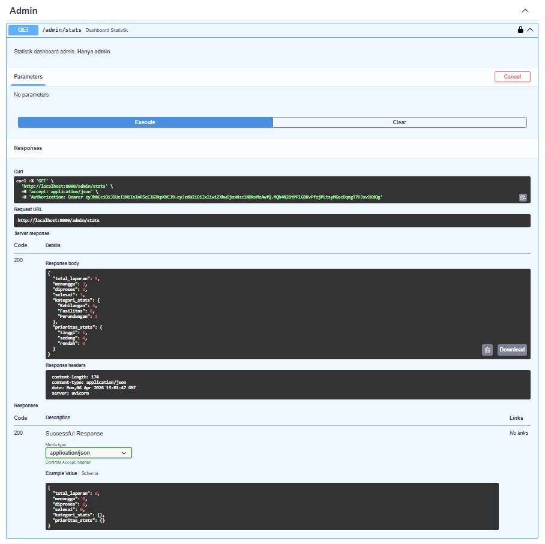

Gambar ini beralih pada dokumentasi untuk _endpoint_ **GET /admin/stats**. _Endpoint_ ini menjadi tumpuan bagi elemen _dashboard_ aplikasi front end dalam menyodorkan metrik laporan kuantitatif pada sistem LaporIn ITK, seperti jumlah laporan yang masuk, menunggu, dan selesai.

Sistem menampilkan riwayat proses melalui **cURL.** Kemudian, server memberikan respons **200**, yang menandakan kalkulasi berhasil diproses. Output data JSON yang diperlihatkan menyajikan berbagai ringkasan statistik krusial—mulai dari `total_reports`, ringkasan agregasi grup berdasarkan penanganan status, jumlah rata-rata unit, serta klasifikasi informasi lainnya sebagai alat ukur efisiensi administrasi laporan.
