# Dokumentasi Hasil Testing Semua Endpoint Via Swagger/Thunder Client

Kegiatan ini merupakan pengujian *endpoint* API menggunakan **Swagger UI** untuk memastikan setiap layanan API pada sistem berjalan dengan baik sesuai fungsinya. API memungkinkan aplikasi saling berkomunikasi dan bertukar data, seperti menambah, menampilkan, memperbarui, dan menghapus data dalam database. Melalui Swagger UI, pengembang dapat melihat dokumentasi API, mengirim permintaan ke server, serta melihat respons sistem secara langsung untuk memastikan proses pengolahan data berjalan dengan benar.

---

# API Test Results (Swagger)

Dokumen ini berisi hasil pengujian API menggunakan **Swagger UI** pada aplikasi yang berjalan di server lokal.

---

## 🔌 API Endpoints

Base URL: `http://localhost:8000`  
Dokumentasi interaktif: `http://localhost:8000/docs`

| Method | Endpoint | Deskripsi | Status Code |
|------  |------      |------   |------       |
| `GET`  | `/health`| Health check API untuk memastikan server berjalan| 200 |
| `GET`  | `/team`| Menampilkan informasi anggota tim | 200 |
| `POST` | `/items` | Menambahkan data item baru | 201 / 422 |
| `GET` | `/items` | Mengambil daftar item (pagination + search) | 200 / 422 |
| `GET` | `/items/stats`| Menampilkan statistik data item | 200 |
| `GET` | `/items/{item_id}`| Mengambil satu item berdasarkan ID | 200 / 404 / 422|
| `PUT` | `/items/{item_id}`| Memperbarui data item berdasarkan ID | 200 / 404 / 422 |
| `DELETE` | `/items/{ittem_id}`| Menghapus item berdasarkan ID | 204 / 404 |

---

### 1. Proses Mengirim Request POST untuk Menambahkan Data

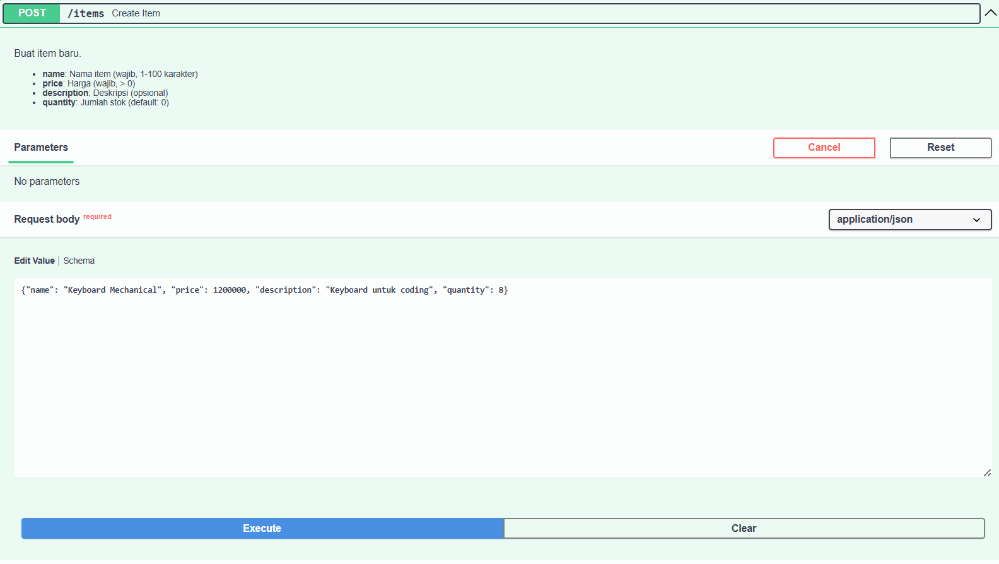 

Gambar ini menampilkan fitur untuk membuat data item baru melalui *endpoint* **POST /items** di Swagger UI. Pengguna perlu mengisi beberapa data seperti **name** (nama barang), **price** (harga), **description** (deskripsi, opsional), dan **quantity** (jumlah stok). Pada bagian **request body** ditampilkan contoh data dalam format JSON. Setelah data diisi, pengguna dapat menekan tombol **Execute** untuk mengirim permintaan ke server agar data item diproses dan disimpan.

 

Gambar ini menunjukkan hasil setelah permintaan pengiriman data dilakukan. Pada bagian ini terlihat contoh perintah **cURL** yang dapat digunakan untuk melakukan request yang sama melalui terminal. Selain itu, terdapat Request URL yang menunjukkan alamat endpoint API yang digunakan, yaitu `http://localhost:8000/items`. Server kemudian memberikan **response code 201**, yang berarti data berhasil dibuat atau disimpan di server. Pada bagian **response body** ditampilkan kembali data item yang telah berhasil disimpan, lengkap dengan informasi tambahan seperti `id`, `created_at`, dan `updated_at`. Hal ini menandakan bahwa sistem telah memproses data yang dikirim dan menyimpannya di database.

 

Gambar ini menampilkan dokumentasi mengenai kemungkinan respons yang diberikan oleh API. Pada bagian **201 Successful Response**, ditunjukkan contoh format data yang akan diterima pengguna jika proses penambahan item berhasil. Data tersebut meliputi nama item, deskripsi, harga, jumlah stok, serta waktu pembuatan data. Selain itu, terdapat juga bagian **422 Validation Error**, yaitu respons yang muncul jika data yang dikirim tidak sesuai dengan ketentuan yang telah ditetapkan, misalnya ada field yang kosong atau format data tidak sesuai. Bagian ini membantu pengguna memahami bagaimana sistem memberikan respons baik ketika proses berhasil maupun ketika terjadi kesalahan input data.

---

### 2. Proses Mengirim Request GET untuk Mengambil Daftar Data

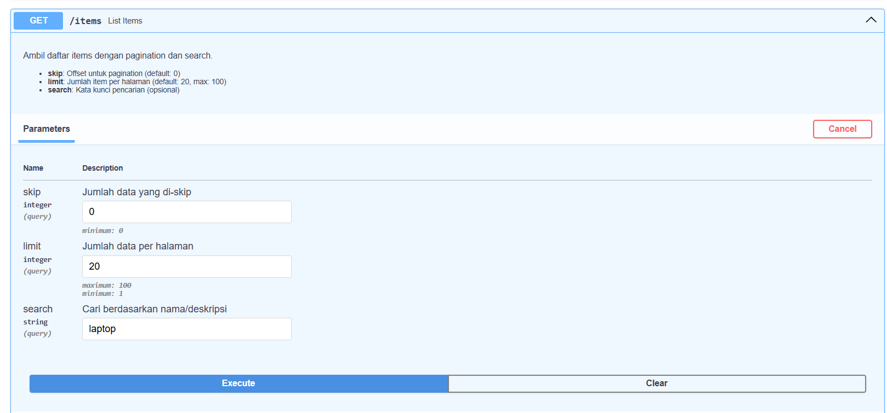 

Gambar ini menampilkan dokumentasi API di Swagger UI untuk *endpoint* **GET /items** yang digunakan mengambil daftar data item. *Endpoint* ini mendukung fitur *pagination* dan pencarian dengan parameter **skip** (jumlah data yang dilewati), **limit** (jumlah maksimal data yang ditampilkan), dan **search** (pencarian berdasarkan nama atau deskripsi). Setelah parameter diisi, pengguna dapat menekan **Execute** untuk mengirim permintaan dan menampilkan data item sesuai parameter.

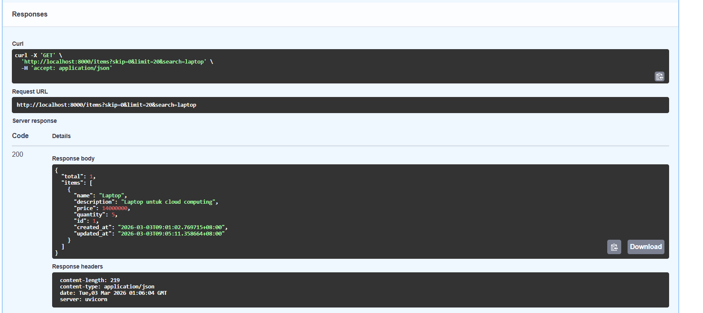 

Gambar ini menampilkan hasil permintaan data menggunakan *endpoint* **GET /items**. Di halaman ini terdapat contoh perintah **cURL**, **Request URL** `http://localhost:8000/items`, serta parameter seperti *skip*, *limit*, dan *search*. Server memberikan **response code 200** yang menandakan permintaan berhasil. Pada **response body** ditampilkan data item dalam format JSON yang memuat informasi seperti *name*, *description*, *price*, *quantity*, serta waktu `created_at` dan `updated_at`. Ini menunjukkan bahwa sistem berhasil mengambil data sesuai permintaan pengguna.

 

Gambar ini menampilkan dokumentasi respons API untuk *endpoint* **GET /items**. Bagian **200 Successful Response** menunjukkan contoh data yang diterima jika permintaan berhasil, berisi total item dan informasi item seperti nama, deskripsi, harga, stok, serta waktu pembuatan atau pembaruan. Sedangkan **422 Validation Error** muncul jika parameter yang dikirim tidak valid atau tidak sesuai ketentuan sistem.

---

### 3. Proses Mengambil Satu Data Berdasarkan ID

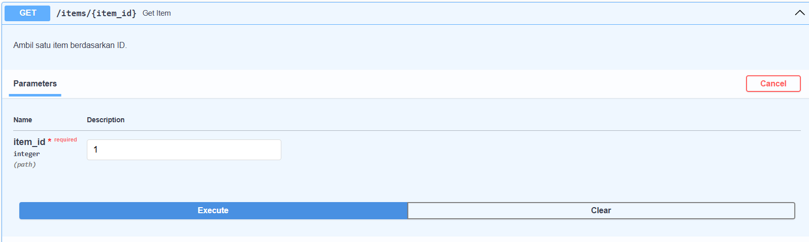 

Gambar ini menampilkan dokumentasi API di Swagger UI untuk endpoint GET /items/{item_id} yang digunakan mengambil satu data item berdasarkan ID. Pada bagian Parameters, pengguna harus memasukkan nilai item_id sebagai parameter wajib. Setelah diisi, pengguna dapat menekan tombol Execute untuk mengirim permintaan ke server dan menampilkan data item sesuai ID yang dimasukkan.

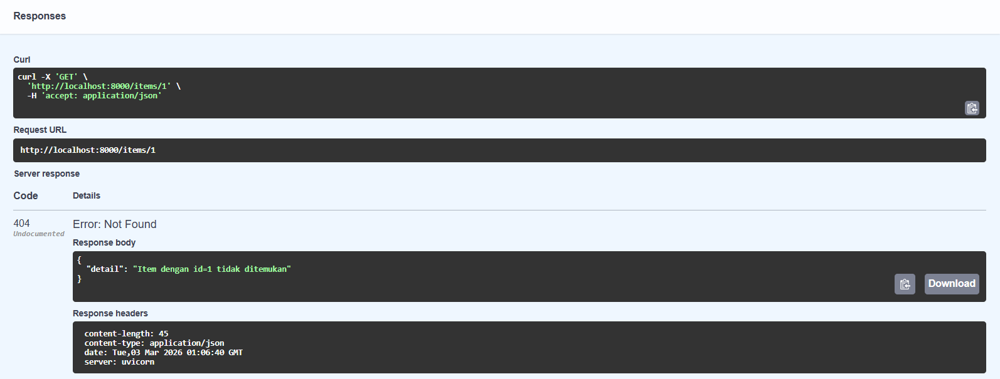 

Gambar ini menampilkan hasil permintaan melalui *endpoint* **GET /items/{item_id}**. Ditampilkan contoh perintah **cURL** dan **Request URL** `http://localhost:8000/items/1`. Server memberikan **response code 404 (Not Found)** yang berarti data dengan ID tersebut tidak ditemukan. Pada **response body** muncul pesan JSON yang menjelaskan bahwa item dengan ID tersebut tidak tersedia di sistem.

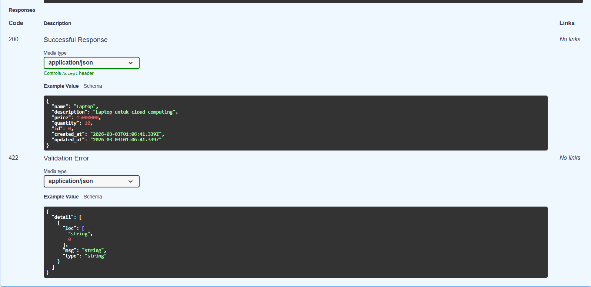 

Gambar ini menampilkan dokumentasi respons API untuk *endpoint* **GET /items/{item_id}**. Bagian **200 Successful Response** menunjukkan contoh data yang diterima jika item berhasil ditemukan, seperti *name*, *description*, *price*, *quantity*, serta waktu `created_at` dan `updated_at`. Sedangkan **422 Validation Error** muncul jika parameter yang dikirim tidak valid atau tidak sesuai ketentuan sistem.

---

### 4. Proses Memperbarui Data Menggunakan PUT

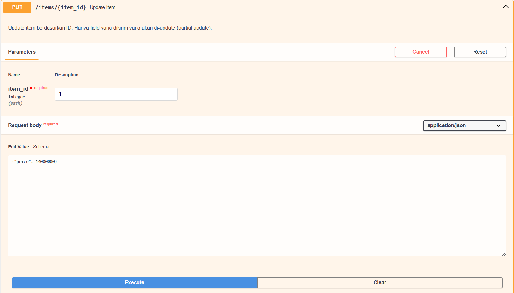 

Gambar ini menampilkan dokumentasi API di Swagger UI untuk *endpoint* **PUT /items/{item_id}** yang digunakan memperbarui data item berdasarkan ID. Pengguna harus memasukkan **item_id** pada bagian **Parameters** dan data yang ingin diubah pada **Request body** dalam format JSON. *Endpoint* ini mendukung **partial update**, sehingga hanya *field* tertentu yang diperbarui, seperti contoh perubahan **price**. Setelah itu, pengguna menekan **Execute** untuk mengirim permintaan pembaruan ke server.

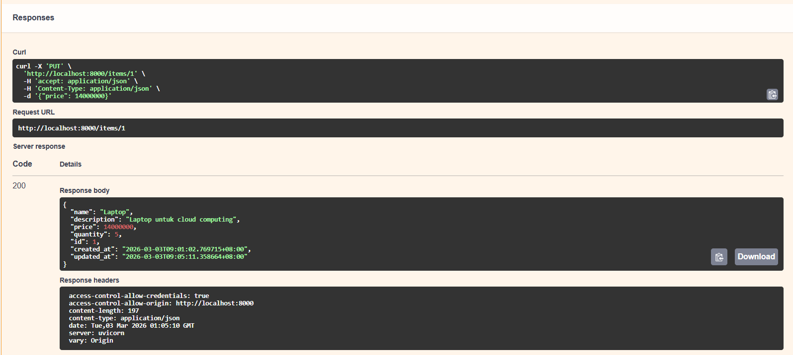 

Gambar ini menampilkan hasil permintaan pembaruan data melalui *endpoint* **PUT /items/{item_id}**. Ditampilkan contoh perintah **cURL** dan **Request URL** `http://localhost:8000/items/1`. Server memberikan **response code 200** yang menandakan pembaruan berhasil. Pada **response body** ditampilkan data item yang telah diperbarui dalam format JSON, termasuk *name*, *description*, *price*, *quantity*, serta waktu `created_at` dan `updated_at`, dengan nilai *price* yang sudah berubah sesuai pembaruan.

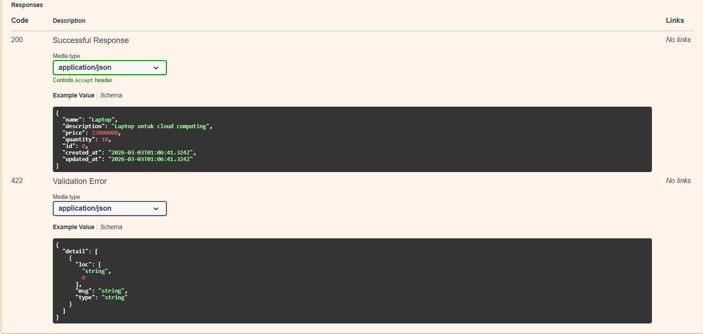 

Gambar ini menampilkan dokumentasi respons API untuk *endpoint* **PUT /items/{item_id}**. Bagian **200 Successful Response** menunjukkan contoh data yang diterima jika pembaruan berhasil, berisi informasi item seperti *name*, *description*, *price*, *quantity*, serta waktu `created_at` dan `updated_at`. Sedangkan **422 Validation Error** muncul jika data yang dikirim tidak valid atau tidak sesuai dengan aturan sistem.

---

### 5. Proses Menghapus Data Menggunakan DELETE

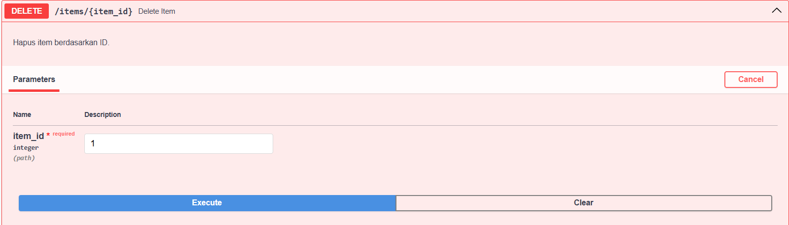 

Gambar ini menampilkan dokumentasi API di Swagger UI untuk *endpoint* **DELETE /items/{item_id}** yang digunakan menghapus data item berdasarkan ID. Pengguna harus memasukkan **item_id** pada bagian **Parameters** sebagai identitas item yang akan dihapus. Setelah itu, pengguna dapat menekan tombol **Execute** untuk mengirim permintaan ke server agar sistem memproses penghapusan data.

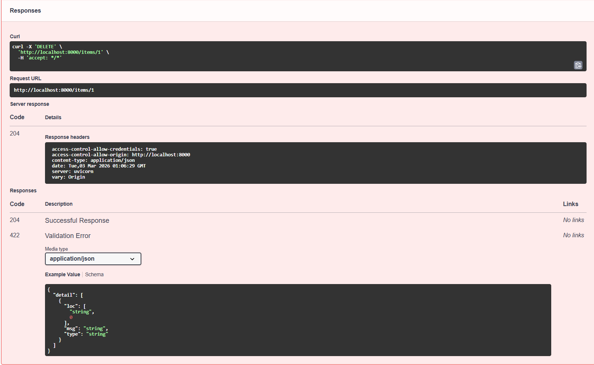 

Gambar ini menampilkan hasil permintaan penghapusan data melalui *endpoint* **DELETE /items/{item_id}**. Ditampilkan contoh perintah **cURL** dan **Request URL** `http://localhost:8000/items/1`. Server memberikan **response code 204** yang menandakan penghapusan berhasil dan tidak ada konten pada **response body**. Pada **response headers** juga ditampilkan informasi tambahan terkait respons dari server.

---

### 6. Menampilkan Statistik Data

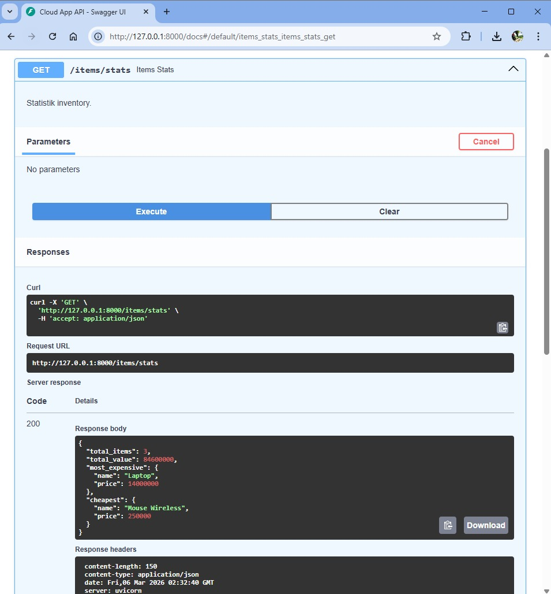 

Gambar ini menampilkan halaman dokumentasi API pada Swagger UI untuk *endpoint* **GET /items/stats** yang digunakan untuk menampilkan statistik data item yang tersimpan dalam sistem. *Endpoint* ini berfungsi untuk memberikan ringkasan informasi mengenai data item yang tersimpan di dalam sistem. Pada bagian **Parameters** terlihat bahwa *endpoint* ini tidak memerlukan parameter tambahan, sehingga pengguna cukup menekan tombol **Execute** untuk menjalankan permintaan ke server.

Setelah permintaan dijalankan, sistem menampilkan bagian **cURL** yang menunjukkan contoh perintah yang dapat digunakan untuk melakukan request melalui terminal. Selain itu, terdapat Request URL yang memperlihatkan alamat endpoint yang digunakan, yaitu `http://127.0.0.1:8000/items/stats`. Server kemudian memberikan **response code 200**, yang menandakan bahwa permintaan berhasil diproses. Hasil respons ditampilkan dalam format JSON yang berisi beberapa informasi statistik, yaitu `total_items` yang menunjukkan jumlah keseluruhan item yang tersimpan sebanyak 3, serta `total_value` yang menunjukkan total nilai seluruh barang sebesar 8.460.000. Selain itu, sistem juga menampilkan informasi mengenai barang dengan harga paling mahal (*most_expensive*) yaitu Laptop dengan harga 1.400.000, serta barang dengan harga paling murah (*cheapest*) yaitu *Mouse Wireless* dengan harga 250.000. Informasi ini membantu pengguna untuk melihat ringkasan item yang tersimpan secara cepat dan terstruktur melalui satu *endpoint* API.