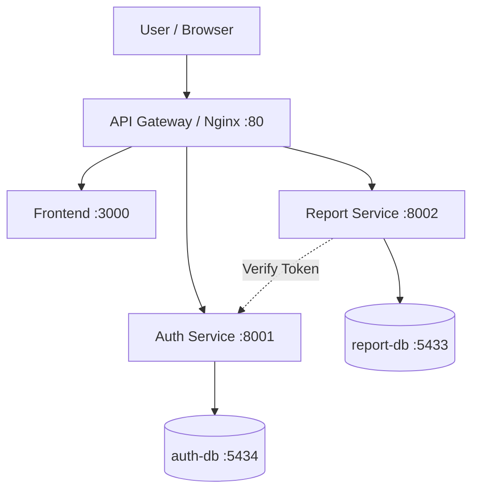
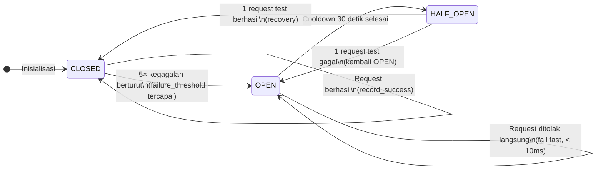
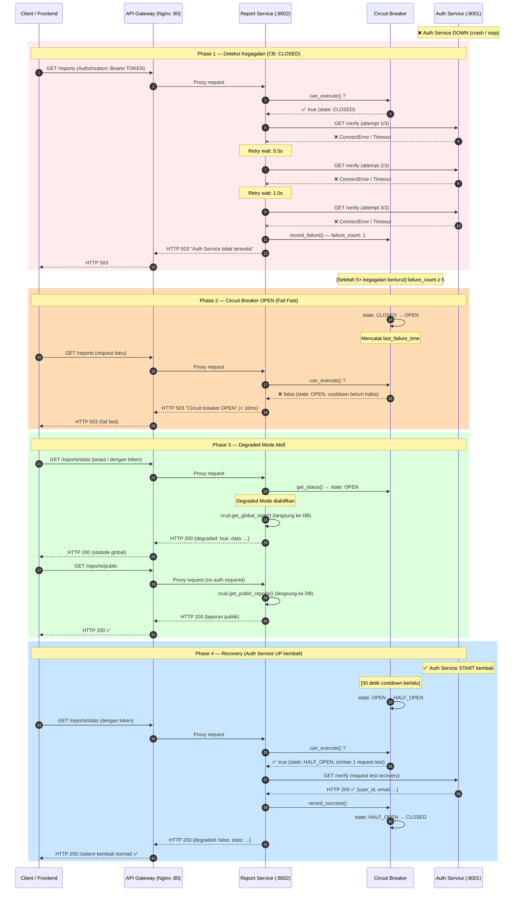
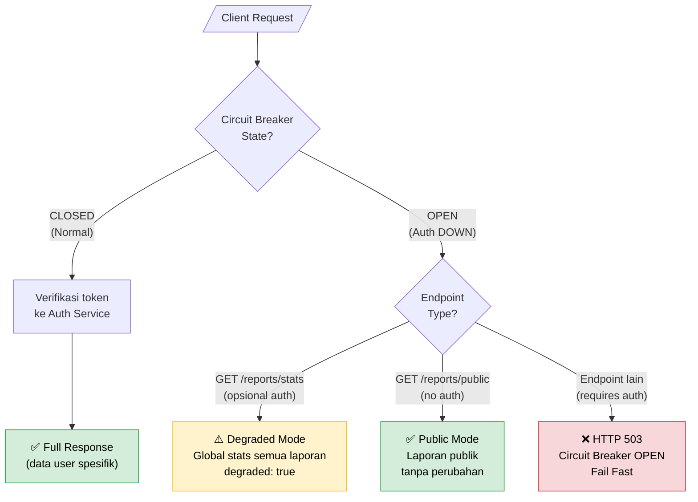

# Microservices Architecture Documentation

## 1. Architecture Diagram



---

## 2. Services & Ports

| Service | Port | Description |
|----------|------|-------------|
| gateway | 80 | API Gateway / Reverse Proxy |
| frontend | 3000 | Frontend LAPORin ITK |
| auth-service | 8001 | Authentication Service |
| report-service | 8002 | Report Management Service |
| auth-db | 5434 | Database pengguna |
| report-db | 5433 | Database laporan |

---

## 3. API Contract

Base URL:

```text
http://localhost
```

### 3.1 Auth Service

#### POST /auth/register

Digunakan untuk registrasi pengguna baru.

**Request**

```json
{
  "name": "Andi Pratama",
  "email": "andi@student.itk.ac.id",
  "password": "Cloud@123",
  "phone": "081234567890"
}
```

**Response**

```json
{
  "id": 1,
  "name": "Andi Pratama",
  "email": "andi@student.itk.ac.id"
}
```

---

#### POST /auth/login

Digunakan untuk login dan mendapatkan JWT Token.

**Request**

```json
{
  "email": "andi@student.itk.ac.id",
  "password": "Cloud@123"
}
```

**Response**

```json
{
  "access_token": "jwt_token",
  "token_type": "bearer"
}
```

---

#### GET /auth/verify

Digunakan untuk memvalidasi JWT Token.

**Header**

```text
Authorization: Bearer TOKEN
```

**Response**

```json
{
  "user_id": 1,
  "email": "andi@student.itk.ac.id",
  "name": "Andi Pratama"
}
```

---

### 3.2 Report Service

#### POST /reports

Digunakan untuk membuat laporan kehilangan.

**Header**

```text
Authorization: Bearer TOKEN
```

**Request**

```json
{
  "category": "Kehilangan",
  "title": "Laptop Tertinggal di Perpustakaan",
  "description": "Laptop ASUS warna hitam tertinggal di ruang baca lantai 2 perpustakaan.",
  "location": "Perpustakaan ITK",
  "incident_date": "2026-05-18",
  "is_anonymous": false
}
```

**Response**

```json
{
  "id": 1,
  "user_id": 1,
  "category": "Kehilangan",
  "title": "Laptop Tertinggal di Perpustakaan",
  "status": "menunggu"
}
```

---

#### GET /reports

Digunakan untuk menampilkan daftar laporan pengguna.

**Header**

```text
Authorization: Bearer TOKEN
```

**Response**

```json
[
  {
    "id": 1,
    "title": "Laptop Tertinggal di Perpustakaan",
    "category": "Kehilangan",
    "status": "menunggu"
  }
]
```

---

#### GET /reports/{id}

Digunakan untuk menampilkan detail laporan berdasarkan ID.

**Header**

```text
Authorization: Bearer TOKEN
```

**Response**

```json
{
  "id": 1,
  "user_id": 1,
  "category": "Kehilangan",
  "title": "Laptop Tertinggal di Perpustakaan",
  "description": "Laptop ASUS warna hitam tertinggal di ruang baca lantai 2 perpustakaan.",
  "location": "Perpustakaan ITK",
  "incident_date": "2026-05-18",
  "status": "menunggu",
  "is_anonymous": false,
  "created_at": "2026-05-18T09:15:00Z"
}
```

---

#### PUT /reports/{id}

Digunakan untuk memperbarui laporan.

**Request**

```json
{
  "title": "Laptop Hilang di Perpustakaan",
  "description": "Laptop belum ditemukan hingga saat ini."
}
```

**Response**

```json
{
  "message": "Laporan berhasil diperbarui"
}
```

---

#### DELETE /reports/{id}

Digunakan untuk menghapus laporan.

**Response**

```json
{
  "message": "Laporan berhasil dihapus"
}
```

---

## 4. Running Locally

Menjalankan seluruh service:

```bash
docker compose up --build -d
```

Melihat container yang berjalan:

```bash
docker compose ps
```

Melihat log seluruh service:

```bash
docker compose logs -f
```

Menghentikan seluruh service:

```bash
docker compose down
```

---

## 5. Testing Antar Service

### 1. Register User

```bash
curl -X POST http://localhost/auth/register \
-H "Content-Type: application/json" \
-d '{
"name":"Andi Pratama",
"email":"andi@student.itk.ac.id",
"password":"Cloud@123",
"phone":"081234567890"
}'
```

### 2. Login User

```bash
curl -X POST http://localhost/auth/login \
-H "Content-Type: application/json" \
-d '{
"email":"andi@student.itk.ac.id",
"password":"Cloud@123"
}'
```

**Response**

```json
{
  "access_token": "TOKEN"
}
```

### 3. Membuat Laporan

```bash
curl -X POST http://localhost/reports \
-H "Authorization: Bearer TOKEN" \
-H "Content-Type: application/json" \
-d '{
"category":"Kehilangan",
"title":"Laptop Tertinggal di Perpustakaan",
"description":"Laptop ASUS warna hitam tertinggal di ruang baca lantai 2 perpustakaan.",
"location":"Perpustakaan ITK",
"incident_date":"2026-05-18",
"is_anonymous":false
}'
```

### 4. Menampilkan Daftar Laporan

```bash
curl http://localhost/reports \
-H "Authorization: Bearer TOKEN"
```

### 5. Menampilkan Detail Laporan

```bash
curl http://localhost/reports/1 \
-H "Authorization: Bearer TOKEN"
```

### 6. Verifikasi Komunikasi Antar Service

Alur pengujian:

1. User login melalui Auth Service.
2. Auth Service menghasilkan JWT Token.
3. JWT Token dikirim ke Report Service.
4. Report Service meminta validasi token ke Auth Service.
5. Auth Service mengembalikan data pengguna.
6. Report Service memproses laporan.
7. Data laporan disimpan ke report-db.

---

## 6. Debugging

Melihat log Auth Service:

```bash
docker compose logs auth-service
```

Melihat log Report Service:

```bash
docker compose logs report-service
```

Melihat log Gateway:

```bash
docker compose logs gateway
```

Melihat seluruh container:

```bash
docker compose ps
```

---

## 7. Hasil Testing

Testing berhasil dilakukan dengan hasil:

- Registrasi pengguna berhasil.
- Login berhasil.
- JWT Token berhasil dibuat.
- JWT berhasil diverifikasi oleh Auth Service.
- Laporan kehilangan berhasil dibuat.
- Daftar laporan berhasil ditampilkan.
- Detail laporan berhasil ditampilkan.
- Laporan berhasil diperbarui.
- Laporan berhasil dihapus.
- API Gateway berhasil meneruskan request ke service yang sesuai.
- Semua container berjalan normal.

Contoh status container:

```text
NAME                STATUS
auth-db             healthy
report-db           healthy
auth-service        running
report-service      running
frontend            running
gateway             running
```

---

## 8. Mekanisme Ketahanan Sistem (Resilience)

Bagian ini menjelaskan mekanisme ketahanan (_resilience_) yang diimplementasikan untuk memastikan sistem tetap beroperasi secara terbatas bahkan ketika Auth Service mengalami kegagalan. Mekanisme ini mencakup **Retry dengan Exponential Backoff**, **Circuit Breaker**, dan **Graceful Degradation**.

---

### 8.1 Komponen Resilience

| Komponen | Implementasi | Lokasi |
|----------|-------------|--------|
| **Retry Logic** | 3× percobaan, exponential backoff (0.5s → 1.0s → 2.0s) | `services/report-service/auth_client.py` |
| **Circuit Breaker** | 3 state: CLOSED → OPEN → HALF_OPEN | `services/report-service/circuit_breaker.py` |
| **Graceful Degradation** | Endpoint stats & public tanpa auth | `services/report-service/main.py` |
| **Health Check** | Status agregat termasuk CB state & DB | `GET /reports/health` |

---

### 8.2 State Machine Circuit Breaker

Circuit Breaker memiliki tiga state yang bertransisi berdasarkan jumlah kegagalan dan waktu cooldown:



---

### 8.3 Alur Saat Auth Service Down — Sequence Diagram

Diagram berikut menggambarkan alur lengkap dari sudut pandang klien ketika Auth Service mati, bagaimana Report Service mendeteksi kegagalan, membuka circuit breaker, dan beralih ke Degraded Mode untuk melayani endpoint yang tidak membutuhkan autentikasi.



---

### 8.4 Endpoint dalam Degraded Mode

Ketika Circuit Breaker dalam keadaan **OPEN**, endpoint Report Service berperilaku sebagai berikut:



---

### 8.5 Konfigurasi Resilience

Parameter resilience dapat dikonfigurasi melalui environment variable atau langsung di source code:

```python
# services/report-service/auth_client.py

MAX_RETRIES = 3          # Jumlah percobaan maksimal
BASE_DELAY = 0.5         # Delay awal exponential backoff (detik)
TIMEOUT_SECONDS = 5.0    # Timeout per request ke Auth Service

# services/report-service/circuit_breaker.py (instance di auth_client.py)
auth_circuit = CircuitBreaker(
    name="auth-service",
    failure_threshold=5,    # Kegagalan berturut sebelum OPEN
    cooldown_seconds=30,    # Waktu tunggu sebelum HALF_OPEN
)
```

**Total waktu tunggu maksimal (worst case) sebelum HTTP 503 dikembalikan ke klien:**

```
(TIMEOUT_SECONDS × MAX_RETRIES) + (BASE_DELAY × (2^0 + 2^1))
= (5.0 × 3) + (0.5 + 1.0 + 2.0)
= 15.0 + 3.5
= 18.5 detik
```

Setelah circuit breaker OPEN, seluruh request yang memerlukan auth dijawab dalam **< 10ms** (fail fast).

---

## 9. Conclusion

Arsitektur microservices pada aplikasi LAPORin ITK berhasil diimplementasikan dengan memisahkan Authentication Service dan Report Service ke dalam layanan yang independen. API Gateway berfungsi sebagai pintu masuk utama aplikasi, sedangkan setiap service memiliki database masing-masing sehingga komunikasi antar layanan menjadi lebih terstruktur.

Sistem dilengkapi dengan mekanisme ketahanan (_resilience_) yang komprehensif: **retry logic dengan exponential backoff**, **circuit breaker tiga-state**, dan **graceful degradation** pada endpoint kritis. Mekanisme ini memastikan sistem tetap dapat melayani pengguna secara terbatas (Degraded Mode) bahkan saat Auth Service mengalami kegagalan, serta pulih secara otomatis tanpa intervensi manual setelah Auth Service kembali beroperasi.

Pengujian menunjukkan bahwa proses registrasi, login, verifikasi token, pembuatan laporan, pengelolaan laporan, komunikasi antar service, dan skenario failure recovery berjalan dengan baik sesuai rancangan.

