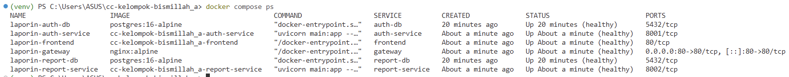
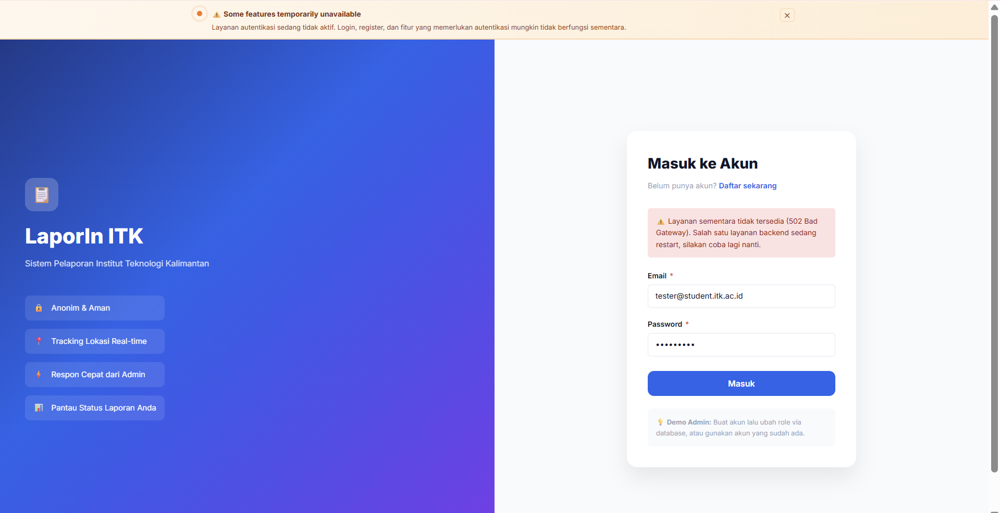
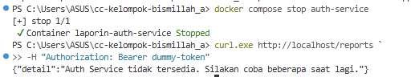
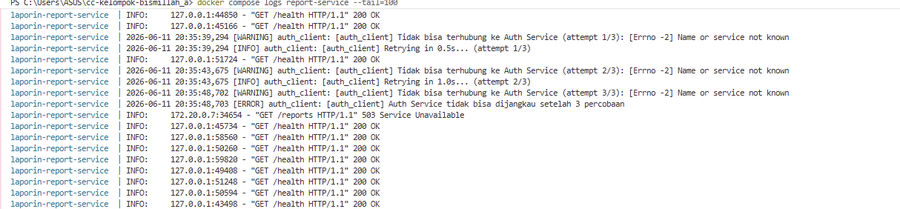
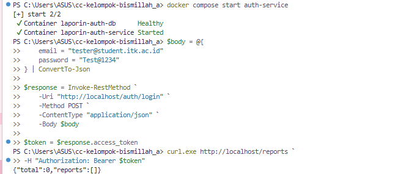

# Reliability Testing

Dokumen ini menjelaskan proses pengujian reliability pada sistem microservices LaporIn. Pengujian dilakukan untuk memastikan aplikasi mampu menangani gangguan komunikasi antar service, tetap berjalan ketika salah satu service mengalami kegagalan, serta dapat kembali beroperasi normal setelah service yang bermasalah dipulihkan.

---

# Test Environment

Komponen yang digunakan dalam pengujian:

- Frontend (React)
- API Gateway (Nginx)
- Auth Service (FastAPI)
- Report Service (FastAPI)
- Auth Database (PostgreSQL)
- Report Database (PostgreSQL)
- Docker Compose
- Windows PowerShell

## Initial Service Status

Sebelum pengujian dilakukan, seluruh container dijalankan menggunakan perintah:

```powershell
docker compose up -d
```

Kemudian dilakukan verifikasi status service:

```powershell
docker compose ps
```

### Bukti Pengujian


Seluruh service berada pada status **Up (healthy)** sehingga pengujian reliability dapat dilakukan.

---

# Test Scenario 1: Service Down

## Objective

Memastikan sistem tetap dapat berjalan ketika Authentication Service tidak tersedia dan memastikan kegagalan pada satu service tidak menyebabkan keseluruhan aplikasi mengalami crash.

## Reproduction Steps

1. Menghentikan Auth Service.

```powershell
docker compose stop auth-service
```

2. Membuka aplikasi melalui browser:

```text
http://localhost
```

3. Melakukan fitur yang membutuhkan Authentication Service seperti proses login atau akses endpoint yang membutuhkan autentikasi.

## Expected Behavior

- Frontend tetap dapat diakses.
- API Gateway tetap berjalan normal.
- Request yang membutuhkan Authentication Service gagal diproses.
- Sistem tidak mengalami crash.
- Service lain tetap berjalan normal.

## Test Result

Ketika Auth Service dihentikan, frontend masih dapat diakses oleh pengguna. Namun request yang membutuhkan proses autentikasi gagal diproses karena Gateway tidak dapat meneruskan komunikasi ke Authentication Service.

### Bukti Pengujian

 

Frontend menampilkan error **502 Bad Gateway**, yang menunjukkan bahwa Authentication Service sedang tidak tersedia, tetapi frontend dan service lain tetap berjalan.

| Expected Behavior | Actual Result | Status |
|---|---|---|
| Frontend tetap dapat diakses | Aplikasi masih dapat dibuka | PASS ✅ |
| Request yang membutuhkan Auth gagal | Gateway menampilkan 502 Bad Gateway | PASS ✅ |
| Service lain tetap berjalan | Gateway, Report Service, dan Database tetap aktif | PASS ✅ |
| Sistem tidak crash | Tidak terjadi kegagalan keseluruhan sistem | PASS ✅ |

---

# Test Scenario 2: Timeout Handling dan Retry Mechanism

## Objective

Memastikan Report Service dapat menangani kegagalan komunikasi dengan Authentication Service menggunakan mekanisme timeout dan retry tanpa menyebabkan sistem berhenti merespons.

## Reproduction Steps

1. Menghentikan Auth Service.

```powershell
docker compose stop auth-service
```

2. Mengirim request ke endpoint Report Service yang membutuhkan validasi token.

```powershell
curl.exe http://localhost/reports `
-H "Authorization: Bearer dummy-token"
```

3. Mengamati response yang diberikan oleh API.

4. Memeriksa log Report Service.

```powershell
docker compose logs report-service --tail=100
```

## Expected Behavior

- Report Service mencoba menghubungi Authentication Service.
- Sistem melakukan beberapa percobaan ulang (retry) sesuai konfigurasi.
- Request tidak menunggu tanpa batas waktu.
- Setelah batas percobaan tercapai, sistem mengembalikan error secara terkontrol.
- Report Service tetap berjalan normal tanpa mengalami crash.

## Test Result

Saat Authentication Service tidak tersedia, Report Service mencoba melakukan komunikasi beberapa kali sesuai mekanisme retry yang diterapkan. Berdasarkan log pengujian, sistem melakukan percobaan sebanyak tiga kali sebelum menghentikan proses.

Setelah seluruh percobaan gagal, Report Service mengembalikan HTTP **503 Service Unavailable** dengan pesan bahwa Authentication Service tidak tersedia.

### Bukti Pengujian 1: Response API

!

Response menunjukkan bahwa request gagal secara terkontrol dan tidak menyebabkan Report Service berhenti berjalan.

### Bukti Pengujian 2: Log Retry Report Service



Log menunjukkan adanya proses retry:

- Attempt 1/3
- Attempt 2/3
- Attempt 3/3

Setelah seluruh percobaan selesai, Report Service mencatat bahwa Authentication Service tidak dapat dijangkau dan mengembalikan response HTTP 503.

| Expected Behavior | Actual Result | Status |
|---|---|---|
| Report Service mencoba menghubungi Auth Service | Sistem melakukan retry sebanyak 3 kali | PASS ✅ |
| Request tidak menunggu tanpa batas waktu | Proses dihentikan setelah batas retry tercapai | PASS ✅ |
| Error ditangani secara terkontrol | Client menerima HTTP 503 Service Unavailable | PASS ✅ |
| Report Service tetap berjalan | Tidak terjadi crash atau hang pada service | PASS ✅ |

---

# Test Scenario 3: Service Recovery

## Objective

Memastikan sistem dapat kembali beroperasi normal setelah Authentication Service dijalankan kembali.

## Reproduction Steps

1. Menjalankan kembali Auth Service.

```powershell
docker compose start auth-service
```

2. Memastikan status service kembali normal.

```powershell
docker compose ps
```

3. Melakukan kembali request ke Report Service menggunakan Authentication Service yang sudah aktif.

## Expected Behavior

- Authentication Service kembali berjalan dengan normal.
- Komunikasi antara Report Service dan Authentication Service berhasil dilakukan.
- Request dapat diproses kembali.
- Sistem tidak membutuhkan restart seluruh container.

## Test Result

Setelah Authentication Service dijalankan kembali, komunikasi antar service kembali berjalan normal. Request yang sebelumnya gagal dapat diproses kembali tanpa perlu melakukan restart pada Gateway, Frontend, Report Service, maupun Database.

### Bukti Pengujian



Report Service berhasil memberikan response yang menandakan bahwa komunikasi dengan Authentication Service telah pulih.

| Expected Behavior | Actual Result | Status |
|---|---|---|
| Auth Service kembali aktif | Status service kembali normal | PASS ✅ |
| Komunikasi antar service berhasil | Request berhasil diproses kembali | PASS ✅ |
| Sistem tidak membutuhkan restart penuh | Semua service tetap berjalan | PASS ✅ |

---

# Test Summary

| No | Scenario | Result | Status |
|---|---|---|---|
| 1 | Service Down | Frontend tetap berjalan dan menampilkan 502 ketika Auth Service tidak tersedia | PASS ✅ |
| 2 | Timeout Handling dan Retry | Report Service melakukan retry dan mengembalikan HTTP 503 ketika komunikasi gagal | PASS ✅ |
| 3 | Service Recovery | Sistem kembali normal setelah Auth Service dijalankan kembali | PASS ✅ |

---

# Conclusion

Berdasarkan pengujian yang dilakukan, sistem microservices LaporIn mampu menangani gangguan pada Authentication Service dengan baik. Ketika service mengalami kegagalan, aplikasi tidak mengalami crash dan kegagalan dapat ditangani secara terkontrol melalui mekanisme timeout dan retry.

Setelah Authentication Service kembali aktif, komunikasi antar service dapat pulih kembali tanpa memerlukan restart keseluruhan sistem. Hal ini menunjukkan bahwa arsitektur microservices LaporIn telah memiliki kemampuan reliability yang baik dalam menangani gangguan antar service.