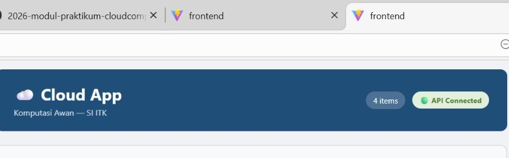
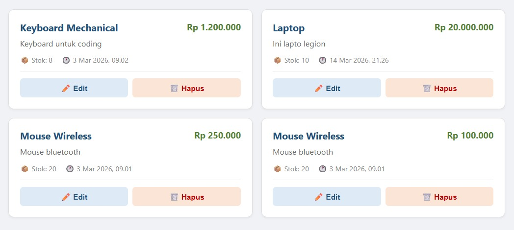
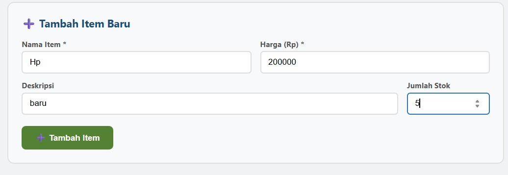
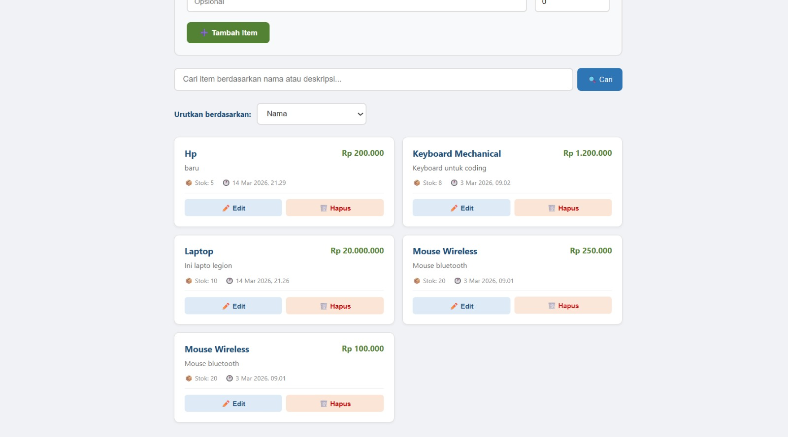
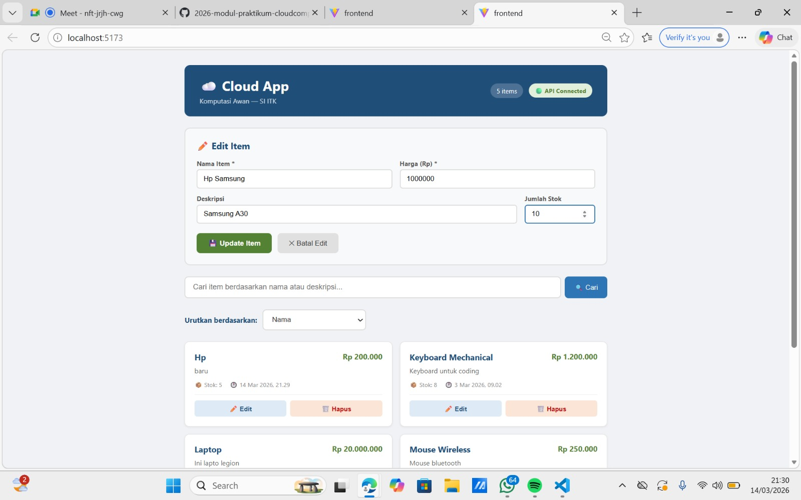
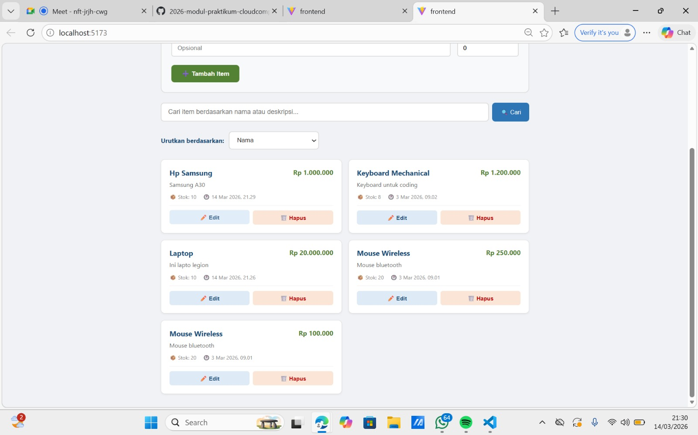
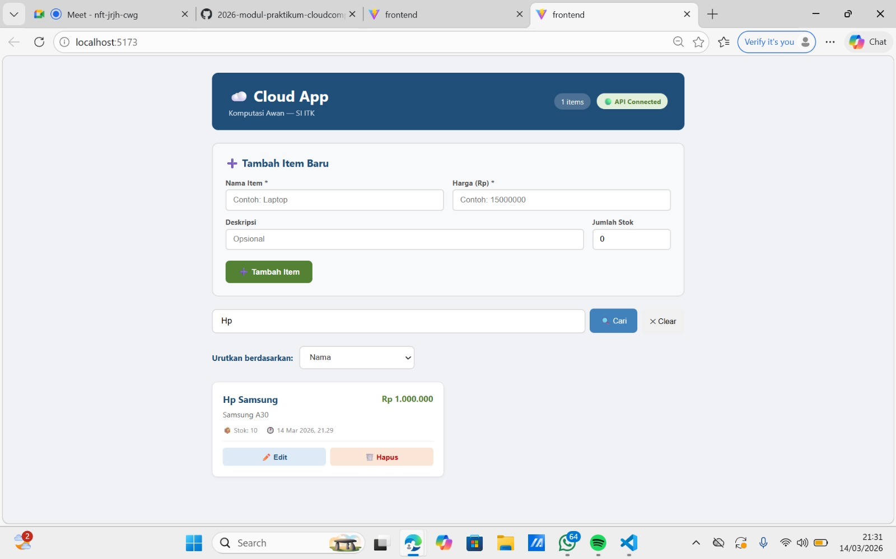
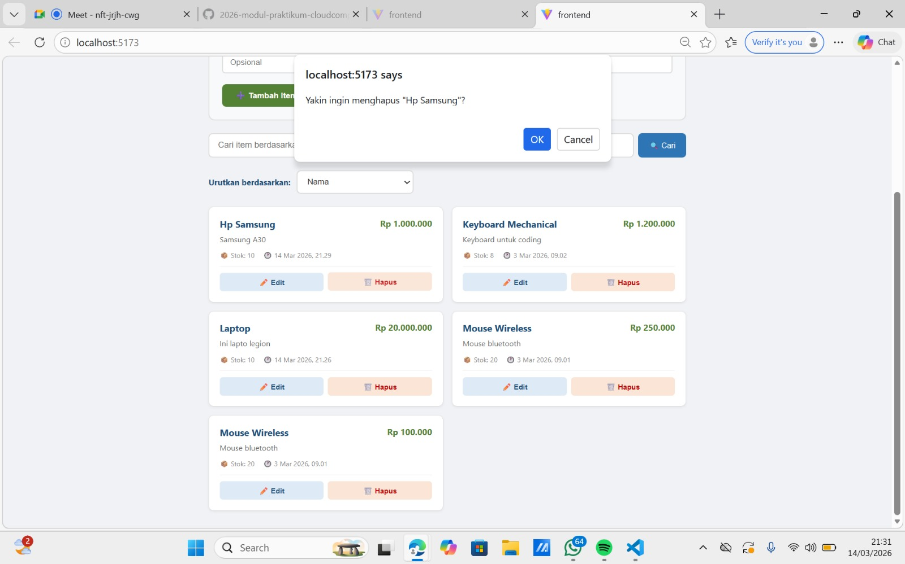
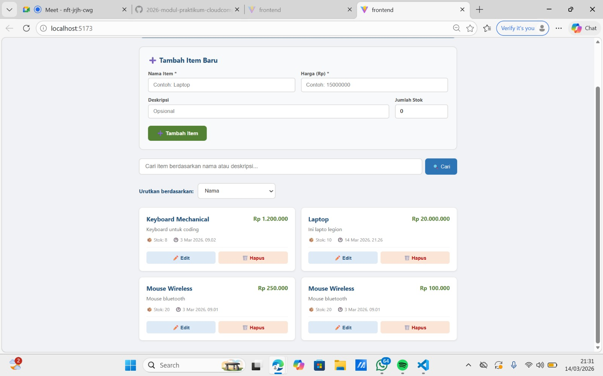
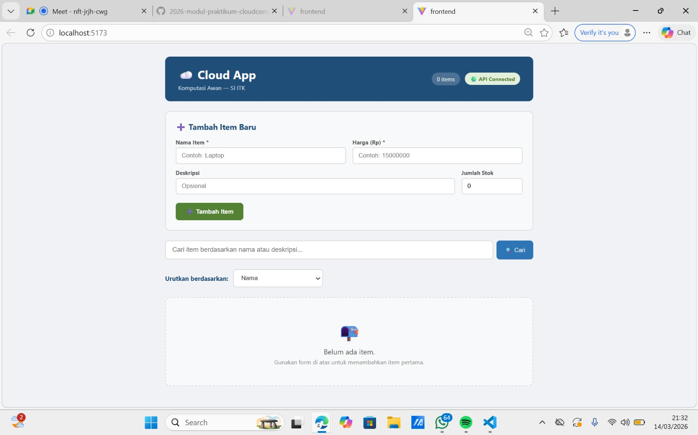

# User Interface Testing Results

Kegiatan ini bertujuan untuk melakukan pengujian terhadap antarmuka pengguna (UI) LaporIn ITK dengan menjalankan seluruh alur fitur pada aplikasi guna memastikan setiap fungsi dapat berjalan dengan baik. Pengujian ini difokuskan untuk menilai efektivitas integrasi antara frontend dan API backend FastAPI serta memvalidasi keandalan sistem dalam proses autentikasi (login/register) serta siklus manajemen pelaporan (mulai saat pengguna mengajukan laporan, hingga diproses oleh admin, dan dimutakhirkan rincian datanya). 

---

## Ringkasan Hasil Pengujian

Jumlah skenario pengujian : 10

| Berhasil | Gagal | 
|------|------|
| 10   | 0    | 

Berdasarkan hasil pengujian yang dilakukan, seluruh fitur aplikasi LaporIn ITK dapat termuat dengan benar dan berjalan dengan baik sesuai dengan kebutuhan fungsionalitas sistem pelaporan.

---

## Daftar Skenario Pengujian

### 1. Cek Koneksi Sistem LaporIn (Status Layanan)

**Tujuan :** Pengujian ini bertujuan untuk memastikan aplikasi frontend dapat dijalankan secara fungsional melalui browser dan berhasil terhubung secara sinkron dengan backend API.

**Hasil :** 

Berdasarkan hasil pengujian, aplikasi berhasil diakses tanpa isu _Network Error_. Hal ini menunjukkan bahwa koneksi jaringan antara komponen frontend dan server backend FastAPI telah tersambung sepenuhnya dan siap melayani pertukaran data login maupun pengiriman laporan.

---

### 2. Menampilkan Daftar Laporan (Dashboard)

**Tujuan :** Pengujian ini bertujuan untuk membuktikan bahwa data laporan yang sebelumya disubmit di database dapat ditarik (fetch) dan divisualisasikan dengan tepat pada halaman _dashboard_ aplikasi.

**Hasil :** 

Sesuai hasil observasi pengujian, riwayat pelaporan historis (seperti Laporan Kerusakan Infrastruktur atau Laporan Kehilangan) berhasil muncul dan dirinci dengan kartu antarmuka (_view card_). Elemen responsif berupa judul laporan, deskripsi singkat, kategori, status berjalan (misal: "Menunggu" atau "Diproses"), dan keterangan lokasi ditampilkan dengan presisi untuk menyajikan laporan secara sistematis.

---

### 3. Pembuatan Laporan Aduan Baru

**Tujuan :** Pengujian ini mengevaluasi kelancaran pengguna baru yang ingin mengajukan aduan pelaporan sistem secara langsung lewat _form_ pengisian yang dirancang.

**Hasil :** 

Formulir buat laporan sanggup diisi dengan mulus. Pengguna dapat memilih tipe kategori (Fasilitas, Kehilangan, dsb.), mencatat detail kejadian pada input kotak rincian deskripsi, hingga mendefinisikan letak ruangannya. Alur submit dipicu melalui komponen tombol Buat Laporan untuk menjamin pelapor tak mengalami distorsi sistem rror.

---

### 4. Memastikan Laporan Terarsip Ke Daftar

**Tujuan :** Memverifikasi apakah laporan yang barusan diajukan spontan masuk dan terekam di daftar histori laporan pengguna.

**Hasil :** 

Sesaat pasca-pengecekan setelah aduan berhasil di-_submit_, catatan laporan terbaru akan menempati tumpukan urutan paling atas. Hal ini mengeaskan fungsionalitas pengiriman data telah memvalidasi persilangan _record_ yang diatur, sehingga pengguna percaya formulirnya tersimpan sebagai berstatus _"Menunggu"_.

---

### 5. Memperbarui Status/Detail Laporan (Verifikasi Admin)

**Tujuan :** Simulasi fungsi hak pengelolaan terhadap Admin (atau unit terkait) saat ingin meninjau ulang dan memperbarui status atau prioritas laporan di dashboard khusus.

**Hasil :** 

Berbeda dari sisi pengguna reguler, jika mengakses sebagai pengelola Admin, opsi penyuntingan dihidupkan pada halaman spesifik _Detail Laporan_. Di sinilah admin mendelegasikan perubahan teknis dan mampu merubah progress stasus laporan menjadi opsi lanjutan penanganan, sehingga fitur pembaruan UI merespons manipulasi tersebut.

---

### 6. Memeriksa Pembaruan Sistem Terealisasi 

**Tujuan :** Validasi pasca-pembaruan penanganan, yakni menastikan apakah revisi informasi pada tahapan manajemen laporan disetujui server dan tampak meluas oleh user lain.

**Hasil :** 

Terlihat bahwa UI mereset _state_ dengan status yang sudah diperbarui pasca interaksi Simpan Perubahan oleh admin. Rona status yang mulanya "Menunggu" bergeser label menjadi "Diproses" atau "Selesai", mensinkronkan pembaruan kepada semua pengguna yang berkepentingan.

---

### 7. Mencari Laporan Melalui Fitur Pencarian

**Tujuan :** Menguji utilitas instrumen filter pencarian (_Search Engine_) untuk meminimalisir waktu penelusuran jika database menyimpan antrean puluhan atau ratusan daftar.

**Hasil :** 

Begitu suatu _keyword_ khusus diketik pada panel penelusuran, aplikasi dengan gesit mensortir rekaman yang tidak berelasi. Hasil filter mengerucut dan menghidangkan sekelompok kecil sisa tiket pelaporan yang mengandung padanan huruf relevan sesuai kata kunci untuk memantapkan fitur pencarian adaptif.

---

### 8. Membuka Diskusi Komentar / Interaksi Pesan Laporan

**Tujuan :** Mengontrol fungsionalitas sarana saling membubuhkan komentar konfirmasi komunikasi seputar _update_ progres antara pemangku kepentingan dan individu pelapor.

**Hasil :** 

Sistem mengakomodir area _text box_ dengan tajuk komentar di bawah _interface_ laporan. Kemampuan aplikasi ketika menangkap pengetikan respons dan proses transmisi pesan (klik _Send/Submit_) tidak menuai gangguan bug, memperlihatkan integrasi peredaran teks dua arah yang optimal.

---

### 9. Respons Komentar Ditampilkan di Kolom Thread

**Tujuan :** Memastikan interaksi tulisan dari form komentar sukses menyala pada rekam jejak linimasa balasan (thread).

**Hasil :** 

Uji coba memanifestasikan letak komentar terbaru yang diserahkan akan tampil ke dalam blok kolom obrolan dengan atribusi penulisnya (Admin/User). Kemunculan ini menjadikannya penunjang kepekaan aplikasi dalam me-refresh rekam UI komentar ke dalam daftar interaksi bacaan.

---

### 10. Tampilan Penanda Data Kosong (Empty State)

**Tujuan :** Menilai kesiapan elemen estetika dan UX penunjang "Empty State" ketika profil seseorang benar-benar terbebas dari keluhan laporan apa pun.

**Hasil :** 

Untuk situasi pencarian hampa maupun tabel laporan pada profil baru, aplikasi dengan cermat membentangkan peringatan indikasi kosong (No Reports Found). Langkah ini mencitrakan UI penanganan ketidakadaan data yang lebih manusiawi melalui pedoman layar intuitif yang tak nampak error, namun informatif membimbing _user_.

